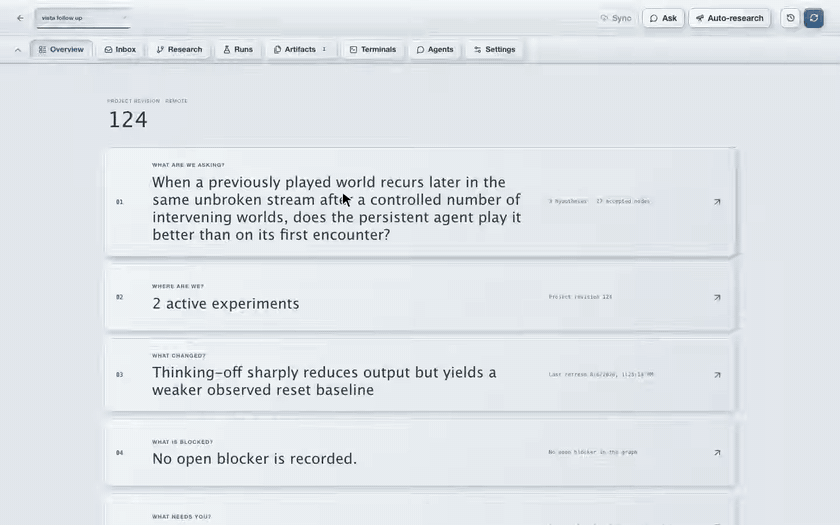
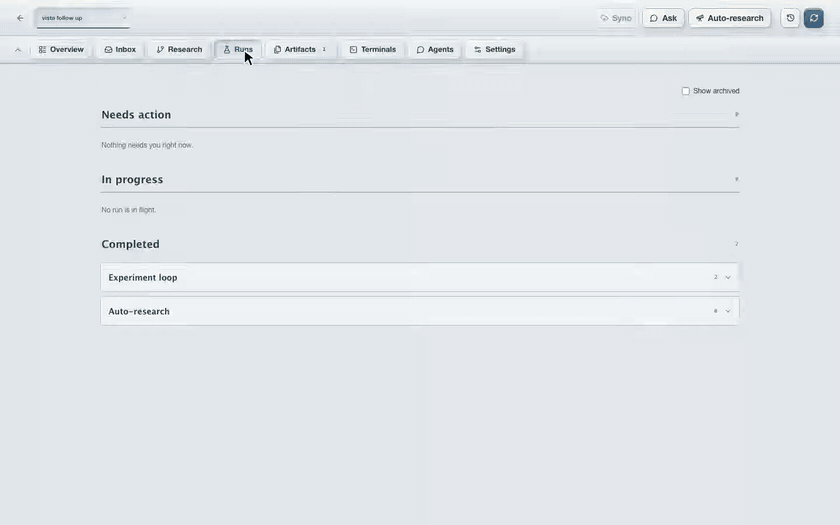

# RCP

**A control panel for research done with coding agents.** RCP turns your Codex
and Claude Code sessions into one durable research graph of questions,
hypotheses, experiments, evidence, and decisions. Agents propose; you decide.
Run it alone on a Mac, or share one team space with your lab on a Linux server.



## Who it's for today

- **Agents:** Codex and Claude Code. More to come.
- **Platforms:** macOS 13+ on Apple Silicon for the desktop app; Ubuntu 22.04
  or 24.04 LTS on x86-64 for the web app and team server. Other platforms when
  contributors bring them.
- **Install:** from source, with the steps below. No binaries yet.

## Set up with your agent

Send this to your agent:

> Clone Zhi0467/RCP from GitHub. Build the web app and, on macOS, the desktop app
> from source, following the README and docs/desktop.md. Then walk me through
> using RCP.

For a Linux machine your team will share as an RCP server, make sure you have SSH
access, then send:

> Set up my RCP team server using `<ssh-host>` as the SSH host, following
> docs/server.md. Pause and ask about optional setup choices or when you need
> sudo access. Then show me how to use my team space in the desktop app,
> including inviting people, transferring projects, and creating shared projects.

## What it does

- **One graph, append-only history.** Questions, hypotheses, experiments,
  evidence, decisions, and blockers, replayable from a patch log and versioned
  in Git.
- **Agents propose, you decide.** Agents create nodes and file Proposals; only
  a human approves one, promotes a claim to project truth, or authorizes an
  autonomous episode.
- **Bounded autonomy.** Dispatch an Experiment or an Auto-research episode from
  the graph with a budget and a Stop. Watchers, recovery, and visual reports
  keep running without an open tab, and the phone UI shows them.
- **Artifacts with a reply path.** Inspect generated artifacts in the built-in
  viewer, annotate text or image regions, and send the annotation back to the
  agent that made it.
- **A paper from approved research.** Build the introduction from
  human-approved nodes while agents keep gathering evidence.
- **Your machines, your subscriptions.** Codex or Claude Code, locally or over
  SSH, with provider, runtime, and model settings per agent role. A team space
  on your own Linux server adds shared projects, member attribution, central
  Git checkouts, and backup/restore.



## Install and run

Everything is built from source. The full steps, the desktop app build, and the
checks that verify a checkout are in [docs/install.md](docs/install.md); the
short version:

```bash
git clone https://github.com/Zhi0467/RCP.git
cd RCP
npm --prefix web ci && npm --prefix web run build
uv sync
uv run rcp open
```

A shared team space on your own Ubuntu server is set up through the
[team server guide](docs/server.md). Design and behavior live in
[docs/design.md](docs/design.md) and [docs/specs/](docs/specs/).
