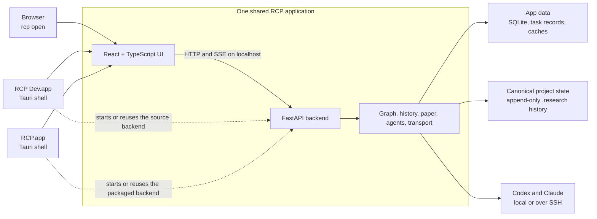
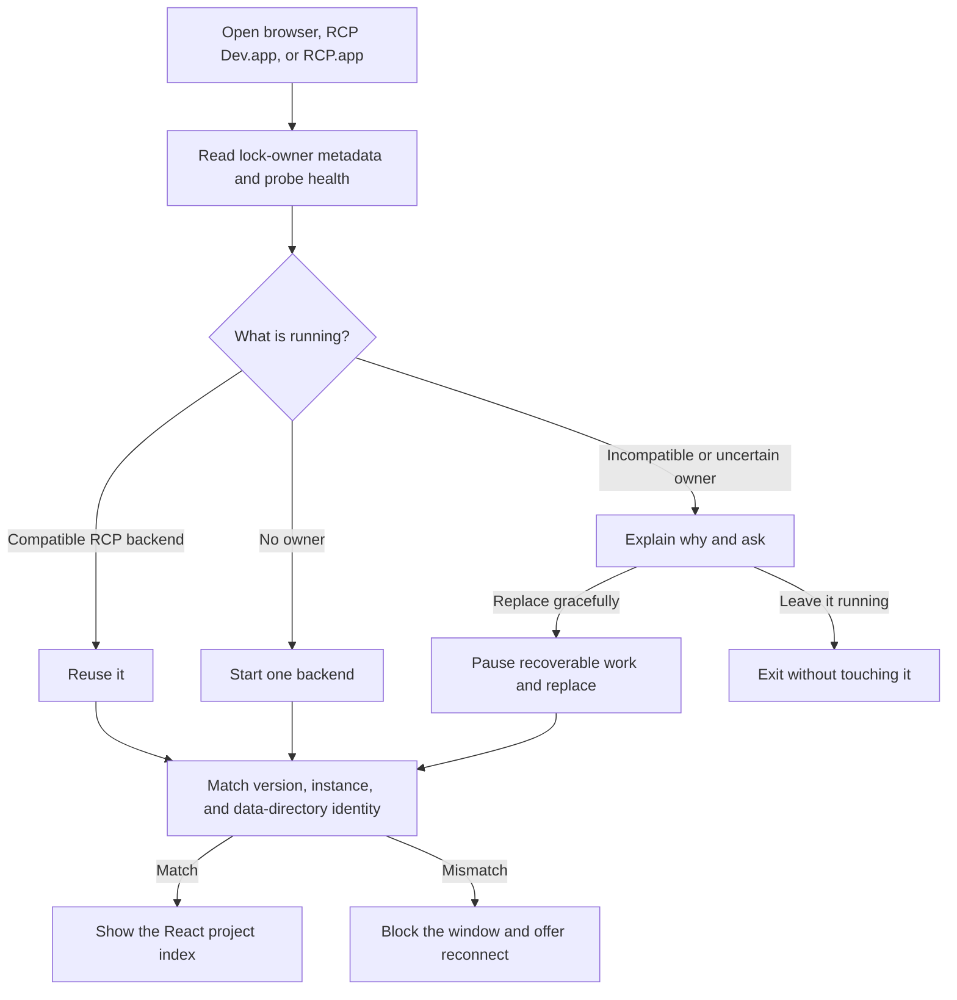

# RCP

RCP is a local research control panel for turning agent conversations, repository
evidence, experiments, and human decisions into one durable research graph and paper
workspace.

RCP has a browser interface and a native macOS app. They are not separate
implementations: both use the same React interface, FastAPI backend, project catalog,
background tasks, and canonical research state.

> **Desktop status:** this repository builds an Apple Silicon macOS application locally.
> Local bundles are unsigned and unnotarized; the repository does not yet publish a public
> download or provide a configured update channel.

## Choose how to run RCP

| Goal                                                  | Use                                | What must be installed                                          |
| ----------------------------------------------------- | ---------------------------------- | --------------------------------------------------------------- |
| Use the self-contained Mac application                | A built `RCP.app`                  | Nothing for RCP itself; Codex or Claude only for agent features |
| Open the current checkout as a normal Mac application | A built `RCP Dev.app`              | This checkout and `uv`                                          |
| Develop Python and React in a browser                 | `uv run rcp serve --reload`        | Python 3.11+, `uv`, Node.js, and npm                            |
| Develop the native shell with live frontend updates   | `npm --prefix web run desktop:dev` | The browser-development tools plus Rust                         |

## System architecture

The desktop app is a native shell around the web app, not a rewrite in Rust.



Most product work therefore has one implementation:

- Python owns the API, project catalog, graph, history, background runs, providers, and
  SSH transport.
- React owns the interface in both the browser and the desktop window.
- Rust and Tauri own only operating-system behavior: native windows, backend startup,
  file dialogs, previews, external links, Quit, and updates.

## Use a packaged desktop build

### Requirements

- Apple Silicon Mac running macOS 13 or newer.
- A built `RCP.app` bundle.
- Codex CLI or Claude Code, installed and authenticated separately, if agent features
  are needed.

The release app does **not** require Python, `uv`, Node.js, npm, React, Rust, or Tauri on
the user's computer. React is compiled into static assets, Python is frozen into a
sidecar executable, Tauri is compiled into the application, and macOS supplies the
system webview.

### Open and use it

1. Open `RCP.app` from Finder.
2. Choose **New project** to connect local or SSH repositories, or open a project that
   is already registered.
3. Configure Codex or Claude in project settings before starting agent work.
4. Use **Overview** for the project summary, **Inbox** for human decisions, **Research**
   for the graph, **Runs** for agent and experiment history, **Paper** for writing,
   **Settings** for project configuration, and **Chats** for project conversations. Use
   **Ask** in the project header to start a project chat.

Clicking the red window button hides RCP; it does not mean Quit. Reopen it from the Dock
or launch it again. **Quit RCP** rechecks whether the application still owns the backend:
it gracefully stops only a backend it started and leaves a compatible terminal-started
backend running.

RCP's local catalog, task records, and rebuildable caches live at:

```text
~/Library/Application Support/research-control-panel/
```

Source and test launches can set `RCP_DATA_DIR` before startup to use a different
app-data directory. A Finder-launched release uses the default unless that environment
is supplied to the application. Canonical research state still lives in the state
repository configured for each project; the desktop app does not create a second
authoritative copy.

## Run from source in a browser

Install the source dependencies once:

```bash
npm --prefix web ci
npm --prefix web run build
uv sync
```

Build the frontend before `uv sync`: `web/dist` is gitignored but is included when the
Python package is built.

Open the project index:

```bash
uv run rcp open
```

Or register and open the included demo project:

```bash
uv run rcp open examples/demo-project/state-repo
```

The demo project is a real fixture. Copy it before running agents or making graph changes
if you need to preserve the checked-in example.

`rcp open` builds the frontend when it starts a new source backend. If a healthy,
compatible RCP backend already owns the same data directory, it reuses that backend and
opens the browser without starting a duplicate.

## Development workflow

### 1. Browser-first development

This is the normal loop for Python, React, graph, API, and background-task work:

```bash
uv run rcp serve --reload
```

Open <http://127.0.0.1:8421>. Python changes restart the backend and frontend changes
rebuild the served bundle. The frontend watcher is not Vite HMR, so refresh the browser
after a React or CSS change.

Without `--reload`, `rcp serve` is an explicit ownership request. It gracefully replaces
the current owner after recoverable work is paused. The launch command owns that
lifecycle; do not hunt for PIDs, delete lock files, or manually kill an RCP process.

### 2. Live native-shell development

Use this while editing Tauri commands, windows, navigation, or desktop-only React paths:

```bash
npm --prefix web run desktop:dev
```

This runs the React frontend through Vite, compiles the Rust shell in debug mode, and
starts or reuses the Python backend from the checkout.

To debug the production-like same-origin arrangement without packaging Python, use:

```bash
npm --prefix web run desktop:same-origin
```

### 3. Build the clickable development app

```bash
npm --prefix web run desktop:build-dev
```

Output:

```text
web/src-tauri/target/debug/bundle/macos/RCP Dev.app
```

`RCP Dev.app` records the checkout and absolute `uv` executable in its `Info.plist`, so
it can sit beside `RCP.app` and launch source code without freezing Python. A complete
Quit followed by reopening starts from current source when no compatible backend is
already running; merely closing its window keeps the existing process alive. Rebuild the
Dev bundle after Rust or Tauri configuration changes.

## Verification

Run the backend and web checks from the repository root:

```bash
uv run pytest
uv run ruff check src tests
npm --prefix web run build
npm --prefix web test
```

For changes to the Tauri shell or desktop packaging, also run the desktop checks:

```bash
cargo fmt --manifest-path web/src-tauri/Cargo.toml -- --check
cargo clippy --manifest-path web/src-tauri/Cargo.toml --all-targets -- -D warnings
cargo test --manifest-path web/src-tauri/Cargo.toml --locked
```

A successful unit suite is only the baseline. For changes to routes, background work,
desktop lifecycle, or a view's data flow, also run the app and exercise the relevant
acceptance scenario in [`docs/acceptance/`](docs/acceptance/).

## Build a release candidate

The first desktop target is Apple Silicon macOS. Building it requires the complete
development toolchain: Python and `uv`, Node.js and npm, and Rust.

```bash
npm --prefix web run desktop:build
```

The command performs the complete local packaging pipeline:

1. Typecheck and compile React.
2. Freeze FastAPI and its Python dependencies with PyInstaller.
3. Put the compiled web assets inside the packaged backend.
4. Prepare the target-specific backend sidecar for Tauri.
5. Compile the Rust shell and assemble `RCP.app`.

Output:

```text
web/src-tauri/target/release/bundle/macos/RCP.app
```

Smoke-test the exact packaged backend rather than accidentally relying on a source
server that the application reused:

```bash
uv run python packaging/smoke-backend.py \
  web/src-tauri/target/release/bundle/macos/RCP.app/Contents/MacOS/rcp-backend
```

Then open the bundle through Finder and verify the native project index and the changed
workflow. Source edits made after this build do not affect `RCP.app`; rebuild to create a
new release candidate.

### Public release work still required

The repository currently creates an unsigned local `.app`. A public release additionally
needs:

1. An intentional version bump.
2. Apple Developer ID signing.
3. Apple notarization and stapling.
4. A downloadable archive or installer with checksums.
5. An updater signing key, endpoint, and published manifest.

`npm --prefix web run desktop:build-signed` is reserved for that configured pipeline; it
is not a substitute for the missing signing and publishing infrastructure.

## Backend ownership and startup

The browser, Dev app, and release app are allowed to coexist because they converge on one
backend and continuously verify its identity.



This prevents two RCP processes from writing the same app data, prevents a desktop
window from silently switching to another backend, and lets the browser and native app
show the same projects and background tasks.

## Core safety model

- `.research/patches/` is append-only. Materialized graph and research files are rebuilt
  from that history rather than edited as independent truth.
- An agent writes a structured `patch.json` in an RCP-created scratch workspace. RCP
  validates it before it can enter canonical history; patches are never parsed out of a
  provider's prose output.
- Agents may assert or propose. Only human UI actions approve gated operations, set
  standing, or change project truth membership.
- Agent runs are server-owned background work. Closing a panel or browser tab does not
  make the invocation request-owned.
- The paper introduction is human-authored. The writing coach is read-only and has no
  Apply path.
- Canonical state may live locally or over SSH. For remote projects, a rebuildable local
  display snapshot can keep a previously opened project readable while RCP reconciles with
  the remote canonical state; authority actions wait for reconciliation.

## Repository map

```text
src/rcp/                 Python backend, graph, agents, history, paper, and transport
web/src/                 Shared React and TypeScript interface
web/src-tauri/           Rust desktop shell, capabilities, icons, and bundle scripts
packaging/               PyInstaller configuration and packaged-backend smoke test
tests/                   Python test suite
web/tests/               TypeScript behavior tests
docs/acceptance/         User-visible promises and their verification drivers
examples/demo-project/   Local project fixture
```

[`docs/research-control-panel-blueprint.md`](docs/research-control-panel-blueprint.md) is
the single design specification. Its version is maintained inside that file; design changes
edit it in place rather than creating amendment files. When implementation and blueprint
disagree, record the disagreement rather than silently choosing one. Acceptance scenarios
define what “done” means for user-visible behavior.
