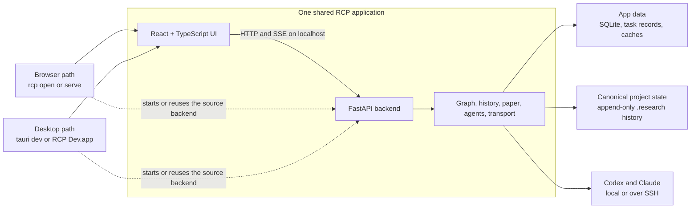

# RCP

RCP is a local research control panel for turning agent conversations, repository
evidence, experiments, and human decisions into one durable research graph and paper
workspace.

RCP currently runs from source in either a browser or a native macOS development shell.
They are not separate implementations: both use the same React interface, FastAPI
backend, project catalog, background tasks, and canonical research state.

> **Desktop status:** development only. This repository can build `RCP Dev.app` for the
> current checkout, but it does not publish a distributable release.

## System architecture

The desktop app is a native shell around the web app, not a rewrite in Rust.



Most product work therefore has one implementation:

- Python owns the API, project catalog, graph, history, background runs, providers, and
  SSH transport.
- React owns the interface in both the browser and the desktop window.
- Rust and Tauri own only operating-system behavior: native windows, backend startup,
  file dialogs, previews, external links, and Quit.

## Development workflow

The browser and desktop paths share the backend, frontend, project catalog, and source
setup. Choose the launch path based on the behavior being tested:

| Path    | Use it for                                       | Main command                       |
| ------- | ------------------------------------------------ | ---------------------------------- |
| Browser | Python, React, graph, API, and background work   | `uv run rcp serve --reload`        |
| Desktop | Tauri commands, windows, and macOS-only behavior | `npm --prefix web run desktop:dev` |

### Shared setup

On a fresh checkout, install and build in this order:

```bash
npm --prefix web ci
npm --prefix web run build
uv sync
```

Build the frontend before `uv sync`: `web/dist` is gitignored but is included when the
Python package is built.

Codex CLI or Claude Code must be installed and authenticated separately to use agent
features.

### Browser path

Start the normal development loop:

```bash
uv run rcp serve --reload
```

Open <http://127.0.0.1:8421>. Python changes restart the backend and frontend changes
rebuild the served bundle. The frontend watcher is not Vite HMR, so refresh the browser
after a React or CSS change.

For a non-reloading source launch that opens the browser automatically, use `rcp open`:

```bash
uv run rcp open
uv run rcp open examples/demo-project/state-repo
```

The demo project is a real fixture. Copy it before running agents or making graph changes
if you need to preserve the checked-in example.

`rcp open` builds the frontend when it starts a new source backend. If a healthy,
compatible RCP backend already owns the same data directory, it reuses that backend and
opens the browser without starting a duplicate.

Without `--reload`, `rcp serve` is an explicit ownership request. It gracefully replaces
the current owner after recoverable work is paused. The launch command owns that
lifecycle; do not hunt for PIDs, delete lock files, or manually kill an RCP process.

### Desktop path

For live native-shell development, run:

```bash
npm --prefix web run desktop:dev
```

This runs the React frontend through Vite, compiles the Rust shell in debug mode, and
starts or reuses the Python backend from the checkout.

For same-origin debugging, a Finder-launchable development bundle, packaged-app testing,
and the release process, see [Desktop testing and release](docs/desktop.md).

Clicking the red window button hides RCP; it does not mean Quit. Reopen it from the Dock
or launch it again. **Quit RCP** gracefully stops only a backend the desktop app started
and leaves a compatible terminal-started backend running.

### Shared application state

Both paths show the same projects and application surfaces: **Overview**, **Inbox**,
**Research**, **Runs**, **Paper**, **Settings**, and **Chats**. **Ask** in the project
header starts a project chat.

RCP's local catalog, task records, and rebuildable caches live at:

```text
~/Library/Application Support/research-control-panel/
```

Set `RCP_DATA_DIR` before startup to use a different app-data directory. Canonical
research state still lives in the state repository configured for each project; app data
does not create a second authoritative copy.

## Verification

Run the backend and web checks from the repository root:

```bash
uv run pytest
uv run ruff check src tests
npm --prefix web run build
npm --prefix web test
```

For changes to the Tauri shell or desktop packaging, follow the relevant native test path
in [Desktop testing and release](docs/desktop.md). That guide also contains the separate
release-candidate checklist.

A successful unit suite is only the baseline. For changes to routes, background work,
desktop lifecycle, or a view's data flow, also run the app and exercise the relevant
acceptance scenario in [`docs/acceptance/`](docs/acceptance/).

## Backend ownership and startup

The browser and desktop development paths can coexist because they converge on one backend
and continuously verify its identity.


This prevents two RCP processes from writing the same app data, prevents a desktop
window from silently switching to another backend, and lets the browser and native app
show the same projects and background tasks.

## Core safety model

- `.research/patches/` is append-only. Materialized graph and research files are rebuilt
  from that history rather than edited as independent truth.
- An agent writes a structured `patch.json` in an RCP-created scratch workspace. RCP
  validates it before it can enter canonical history; patches are never parsed out of a
  provider's prose output.
- Agents may assert or propose. Only human UI actions approve gated operations, set
  standing, or change project truth membership.
- Agent runs are server-owned background work. Closing a panel or browser tab does not
  make the invocation request-owned.
- The paper introduction is human-authored. The writing coach is read-only and has no
  Apply path.
- Canonical state may live locally or over SSH. For remote projects, a rebuildable local
  display snapshot can keep a previously opened project readable while RCP reconciles with
  the remote canonical state; authority actions wait for reconciliation.

## Repository map

```text
src/rcp/                 Python backend, graph, agents, history, paper, and transport
web/src/                 Shared React and TypeScript interface
web/src-tauri/           Rust desktop shell, capabilities, icons, and bundle scripts
packaging/               PyInstaller configuration and packaged-backend smoke test
tests/                   Python test suite
web/tests/               TypeScript behavior tests
docs/acceptance/         User-visible promises and their verification drivers
examples/demo-project/   Local project fixture
```

[`docs/research-control-panel-blueprint.md`](docs/research-control-panel-blueprint.md) is
the single design specification. Its version is maintained inside that file; design changes
edit it in place rather than creating amendment files. When implementation and blueprint
disagree, record the disagreement rather than silently choosing one. Acceptance scenarios
define what “done” means for user-visible behavior.
