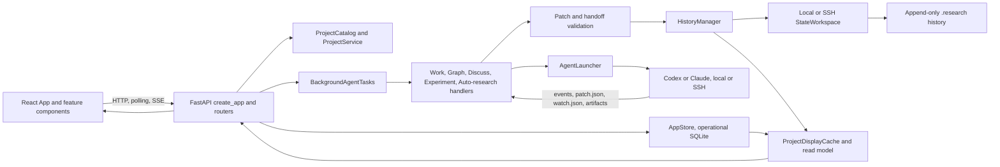

# RCP Architecture and Prompt Audit

## Conclusion

RCP has a strong canonical-state core, but the application around that core has become an orchestration-heavy modular monolith: three oversized control surfaces, `create_app`, `BackgroundAgentTasks`, and `App`, coordinate several partially overlapping state machines through callbacks, shared SQLite access, post-hoc snapshot mutation, and locally hidden dependency cycles. ~~The most urgent issue is more basic: this source snapshot is incomplete and cannot build or collect its test suite.~~ That was an artifact of a bad extraction and is not true of this repository — see the status section below.

## Status, updated 2026-08-18

This audit was run against an extracted copy of the repository, not this checkout. Two prompt
findings have since been acted on, one was declined, and one was wrong. Read the section below
before acting on anything in section 9 or section 10.

**The snapshot findings are false for this repository.** Every file the audit reports as missing is
present here: all eight Python modules, `web/src/projectTransition.ts`, `web/src/experimentGuidance.ts`,
`docs/design.md`, and `docs/specs/`. `uv run pytest --collect-only` exits 0 and collects 2201 tests.
The "Scope and verification boundary" section, risk 1 in section 2, the dead-documentation bullet in
section 6, and all of P0 in section 10 describe a bad extraction. Ignore them. The structural
findings were checked against this checkout and hold.

**Reading this document without a software background.** Appendix A at the end explains the
five main structural findings from scratch, defining each term and grounding every claim in
code from this repository. Start there if sections 2, 3, and 8 are hard to act on.

**Fixed: the write-authority contradiction (section 9, failure 1).** The Work contract now renders
the resolved `ProjectWriteScope` instead of describing it. `write_scope_section` in
[prompts.py](../../src/rcp/agents/prompts.py) builds the block from the same object that configures
the provider sandbox, so the prompt and the enforcement cannot disagree. It lists the writable
roots, the denied paths inside them, and states that a write outside them is a provider denial
rather than a permission the agent can request. It also says that a repository on another host is
outside the boundary, which the old prose blurred. The block appears in the standalone Work launch
contract, the Experiment-loop contract, and every Work turn envelope. The chat master context is
sent once and outlives any single resolution, so it points at the per-turn block instead of freezing
roots that can move. `CHAT_MASTER_CONTEXT_VERSION` was bumped so live sessions re-bootstrap.

**Fixed: over-anchoring examples (section 9, failure 5).** The fabricated "at least ten minutes"
threshold is gone; the criterion is now whether the work outlives the turn. The scheduler-specific
rule was rewritten as the general principle it always was — ask for the set of live work and test
membership, because a finished id and an unreachable service are usually reported the same way. It
now carries two worked examples, a scheduler job and a local process, both verified against the
watcher exit contract, and says outright that they show the exit contract rather than preferred
tools. The audit's own suggestion here was rejected: RCP does not probe the machine for `squeue` to
decide which examples to ship. Examples are examples, and shipping a few varied ones teaches the
class without any detection machinery.

**Declined: send only the active contract (section 9, failure 2).** The master context is read once
into the native session and stays there for the conversation, so withholding the inactive contract
saves a one-time cost while adding session state and invalidating a stable cached baseline. More to
the point, the design already trusts the turn marker to select the active contract. Building
machinery to physically withhold the other one contradicts that. This is invariant 10d in
[AGENTS.md](../../AGENTS.md) and it stands.

**Partly wrong: normative policy duplicated across prose and code (section 9, failure 4).** The
claim is right about the watcher protocol and about the Evidence `origin`, `role`, and `assessment`
enums, which the Patch JSON Schema already carries. It is wrong about the graph authoring rules more
broadly. The base relation endpoint table and the node id prefixes live in `RELATION_SPEC` in
[models.py](../../src/rcp/core/models.py), which is Python and never reaches the agent. The
materialized `ontology` field carries only extensions and is empty for a base project, and its
pointer is sent only when the project has extensions. So the prose table is the only place the agent
learns the base relations, and deleting it would break authoring. The two do currently agree, but
nothing keeps them agreeing — generating that block from `RELATION_SPEC` remains worth doing.

## Scope and verification boundary

I reviewed the extracted repository under `/mnt/data/repo_audit`, approximately 111,000 source lines across 188 Python and frontend source files. The audit used source tracing, AST import and complexity analysis, exact-clone detection, prompt rendering with representative inputs, and test collection.

The snapshot is not self-consistent:

- `PYTHONPATH=src pytest --collect-only -q` exits with status 2 and 93 collection errors. The first failures are missing internal modules, not failed assertions.
- Eight imported Python modules are absent: `rcp.agents.write_scope`, `rcp.core.operations`, `rcp.core.transition_models`, `rcp.core.transitions`, `rcp.history.branches`, `rcp.runs.branch_merge_request`, `rcp.runs.branch_merge_task`, and `rcp.runs.transition_event_reconciliation`.
- The frontend has five unresolved relative imports caused by two missing modules: `web/src/projectTransition` and `web/src/experimentGuidance`.
- `README.md:223-230` and `AGENTS.md:11-17` identify `docs/design.md` and `docs/specs/` as current architectural authority, but neither exists in this snapshot.

These omissions materially limit confidence around graph transitions, branch merge semantics, exact project write-scope resolution, and part of the frontend draft-transition reducer. Call sites and surrounding invariants were still auditable.

## 1. Primary dependency flows



The intended high-level split is documented in `README.md:20-50`: React owns the interface, FastAPI owns application behavior, and Tauri remains a thin operating-system shell. Operational records and caches live in app data, while canonical research state remains append-only under `.research` (`README.md:138-146`, `README.md:196-211`). That separation is sound.

### Canonical graph write flow

1. A human sync or an agent run creates a candidate transition or `patch.json`.
2. The candidate is parsed and validated against current state. Agent validation occurs both during the run and again at commit time.
3. A graph-writing run obtains the local or remote run lock. The local implementation uses `.agent-run.lock` and `flock` (`transport/state.py:661-692`); the remote implementation uses an advisory process lock (`transport/state.py:1248-1301`).
4. `HistoryManager.append` enters the workspace transaction and append lock, rematerializes current state, checks the expected revision, validates, appends, rematerializes, and publishes (`history/manager.py:484-575`). Human batches are built from fresh state while the same lock is held (`history/manager.py:1055-1115`).
5. The display read model is refreshed and returned to the UI.

This is the strongest lifecycle in the system. Freshness is checked under the same append lock used by writers, and canonical state is regenerated from history rather than edited independently.

### Agent task lifecycle

The durable task status model is `queued -> running -> pausing -> paused` or a terminal `succeeded`, `failed`, or `interrupted` state (`storage/models.py:202-216`). A task also carries a parent operation, episode, provider session, stage, graph target, write-scope fingerprint, phase, and receipts (`storage/models.py:280-315`).

The live lifecycle is spread across four layers:

1. An API route asks `BackgroundAgentTasks` to create a typed task record in SQLite.
2. `BackgroundAgentTasks._create_and_spawn` performs admission, parent/episode binding, continuation checks, and worker creation (`background.py:3136-3312`).
3. A worker thread calls `_run`, which creates a new event loop with `asyncio.run`, invokes `_consume`, updates durable status, triggers callbacks, and cleans up (`background.py:3622-3779`).
4. `_consume` decodes provider frames, checkpoints session identity, stores usage and receipts, accumulates graph updates and artifacts, and translates pause/error events (`background.py:3870-4006`).

The persistence is useful, but the lifecycle is not represented as one explicit transition system. It is reconstructed through branches in `BackgroundAgentTasks`, run handlers, storage methods, and callbacks defined inside `create_app`.

### Episode and Auto-research lifecycle

Episodes are mode-neutral durable parents with statuses `queued`, `running`, `stopping`, `wrapping_up`, `needs_action`, `completed`, `stopped`, and `failed`; wrap-up has a second state machine (`storage/models.py:398-447`). Auto-research adds branch identity, child admissions, mail, lifecycle notices, merge eligibility, and report generation. Experiment loops add invocation budgets, watcher delivery, provider-session continuity, attempt bookkeeping, and human pause conditions.

Startup performs a long reconciliation sequence before the application yields: reserved roots, committed dispatches, child admissions, orphaned failures, lifecycle and mail, every Auto-research and Experiment episode, recovery passes, graph conditions, and watcher workers (`api/app.py:1108-1195`). This is evidence that the state is durable, but also that its invariants are distributed enough to require a large boot-time repair program.

### Watcher lifecycle

A Work or Experiment agent writes `watch.json`. RCP validates and persists either external observers or canonical graph conditions. Watchers move through `active`, `degraded`, `completed`, or `stopped` (`storage/models.py:1096-1096`, `storage/models.py:1206-1253`). External checks are polled; graph conditions are evaluated at accepted graph boundaries and startup. A completed group is atomically claimed, creates a continuation task, and is marked notified.

Watcher identity includes the originating task, chat, optional episode, graph target, execution host, and a full continuation profile (`storage/models.py:1124-1147`, `storage/models.py:1206-1244`). This makes a watcher durable, but also turns it into a second task-dispatch envelope that duplicates much of the agent-task state.

### Human draft and transition lifecycle

The frontend keeps canonical project state, a `HumanDraft`, transition head, ruleset tag, manifest, preview projection, sync fences, and local-storage persistence in `App` (`web/src/App.tsx:670-689`). `syncHumanDraft` is a 185-line transaction coordinator that:

- rejects sync under several local and canonical conditions;
- normalizes a draft and creates an expected-head fence;
- tracks the request in a transition coordinator reducer;
- posts the sync;
- decides whether a response may still be applied to the active tab;
- reloads canonical state after stale or displaced responses;
- reconciles retained local draft state and transition manifests;
- clears the in-flight fence (`web/src/App.tsx:2186-2370`).

The missing `projectTransition` module contains the central reducer and routing functions imported at `web/src/App.tsx:64-77`, so this lifecycle cannot be reviewed completely.

### Read-model and cache lifecycle

`ProjectService.project_snapshot` combines canonical graph, paper, configuration, and default experiment controls (`service.py:907-983`). It cannot read operational task state. `ProjectDisplayCache.attach_experiment_control` therefore mutates every outgoing snapshot with live episode/task data. Its own docstring warns that any route which forgets this step can blank the Experiment lifecycle shown to the user (`projects.py:1425-1436`). This is a direct consistency hazard between canonical and operational state.

## 2. Highest-risk dependency points

| Rank | Risk | Why it is high risk |
|---|---|---|
| 1 | Incomplete source and missing current design authority | The backend cannot collect 93 test modules, the frontend has unresolved imports, and the documented current design/specification files are absent. Changes cannot be validated against either executable or documentary authority. |
| 2 | `api/app.py:create_app` | At 2,946 lines, it is the DI container, route registry, startup/shutdown coordinator, cache assembler, task dispatcher, episode recovery coordinator, watcher bootstrap, and home of many business callbacks. A heuristic scan counted roughly 441 decision points. See `api/app.py:333-3278`. |
| 3 | Implicit durable-task state machine | `BackgroundAgentTasks` is a 3,916-line class with 70 methods. It coordinates SQLite status, threads, per-thread event loops, provider sessions, stages, episodes, watchers, callbacks, and recovery. The repeated “lost its durable task/episode/branch identity” guards in `api/app.py:623-653` are compensating controls for this fragmented model. |
| 4 | `AppStore` god repository | `storage/__init__.py:1-43` explicitly says `AppStore` is the whole public surface and mixins exist only to avoid a 10,000-line file. Across its base and mixins, it exposes approximately 246 public methods over one SQLite database. Domain ownership and cross-table transaction boundaries are therefore implicit. |
| 5 | Split canonical/operational project snapshots | A `ProjectSnapshot` looks complete but is not. Every caller must remember post-hoc decoration. The code acknowledges that omission can erase visible lifecycle state (`projects.py:1425-1436`). |
| 6 | Frontend `App` as a mega-controller | `App` spans 3,319 lines and owns routing, project tabs, identity, desktop lifecycle, canonical reconciliation, local drafts, transitions, task launch, chats, graph panels, paper, watchers, and dialogs (`web/src/App.tsx:567-3885`). The missing transition module makes this worse. |
| 7 | Hidden architectural cycles | There are no top-level runtime import cycles in the supplied Python source, but local imports and package barrels create three strongly connected architectural groups. This allows import-time execution while preserving bidirectional design dependencies. |
| 8 | Operational SQLite as a broad single failure domain | Corruption or migration failure does not destroy canonical `.research` truth, but it can simultaneously affect identity, memberships, tasks, episodes, watchers, result views, and caches. `AppStoreBase._initialize` is a 1,158-line schema/bootstrap/migration function (`storage/base.py:125-1282`). |

### Circular dependency groups

Static import analysis found three multi-module strongly connected groups when local imports are included:

1. **Orchestration cycle, 11 modules.** `background` depends on Auto-research, episode report, task policy, agents, and service; recovery/report/shared modules import `BackgroundAgentTasks` or `AgentTaskExecution` locally. Representative edges are `background.py:15-43`, `runs/auto_research_recovery.py:13`, `runs/episode_report.py:41`, and `runs/shared.py:33`.
2. **Validation/materialization cycle, 7 modules.** `materialize` imports validation; patch validation imports materialization locally; proposal validation imports the patch operation validator locally. See `core/materialize.py:46`, `core/validation/patch.py:104,697`, and `core/validation/proposals.py:573`.
3. **Storage/watcher cycle, 5 modules.** The storage package imports experiment and watcher mixins, watcher behavior imports the storage package, and watcher storage imports experiment storage. See `storage/__init__.py:11-23`, `watchers.py:32`, `storage/watchers.py:19`, and `storage/experiments.py:83`.

These are not immediate import crashes because the reverse edges are delayed or hidden behind package exports. They are still evidence that dependency direction is not well defined.

## 3. The three most problematic structural abstractions

### 1. `ProjectService` plus mutable `ProjectSnapshot`

The abstraction claims to be a project-facing service and read model, but it cannot assemble the operational truth needed by the UI. `ProjectService.project_snapshot` supplies graph-derived experiment controls (`service.py:934-938`), then `ProjectDisplayCache` must overwrite them with SQLite-derived task and episode state. A route can return a validly typed but semantically incomplete snapshot.

The branch abstraction leaks in the same way. `ProjectService.for_graph_target` creates a second full `ProjectService` around a branch-specific `HistoryManager`, while retaining paper, launcher, provider skills, and repository inventory (`service.py:654-681`). A graph target should be an explicit parameter of graph queries and commands, not a reason to clone a broad service object.

**Replacement:** separate command services from a `ProjectReadModelAssembler` that explicitly joins canonical state, operational state, provider readiness, and cache status. Make completeness part of the return type, not a caller convention.

### 2. `AppStore` as a mixin-composed whole-system API

The mixins improve file size only. They do not create bounded contexts, ownership, or interfaces. `AppStore` exposes spaces, projects, result views, episodes, Auto-research, children, experiments, watchers, tasks, and row mapping as one object (`storage/__init__.py:26-43`). Any orchestration module can reach any table through the same dependency.

This makes multi-domain transitions difficult to locate and test. A caller may perform several committed connection contexts rather than one explicit unit of work, while every connection context auto-commits (`storage/base.py:115-123`).

**Replacement:** per-context repositories with narrow protocols, plus an explicit SQLite unit of work for transitions that span task, episode, watcher, and child records. One physical database is acceptable; one logical API is not required.

### 3. “Agent task” as an implicit distributed state machine

A task is nominally one record, but correctness depends on coordinated identity across an operation ID, parent operation, episode, graph target, stage root, provider-native session, write-scope fingerprint, watcher group, lifecycle mail, and receipts. Request kind is mapped repeatedly through `if`/`isinstance` branches, including `_request_from_record` and `_validate_request_type` (`background.py:4141-4169`). `create_app` then redispatches the same kinds through a large nested stream function (`api/app.py:623-824`).

**Replacement:** one discriminated `RunEnvelope` and a handler registry. Each handler owns `admit`, `stage`, `execute`, `settle`, and `recover`. Persist state transitions as typed events or a transition log and reduce them into the task/episode read model. Recovery should replay the same transition rules instead of implementing a parallel startup algorithm.

## 4. Most difficult modules for a new senior engineer

1. **`src/rcp/api/app.py`**. There is no clean composition boundary. Understanding one route can require following nested closures that capture the catalog, store, cache, background tasks, episode coordinators, locks, and watcher registries.
2. **`src/rcp/background.py`**. It contains the actual durable task lifecycle, admission, recovery, pause/resume/retry, thread ownership, event-loop ownership, and settlement semantics.
3. **`src/rcp/runs/work.py`**. At 5,202 lines, it combines turn resolution, staging, prompt composition, watcher maintenance, live correction mailboxes, patch validation, Work commit, Experiment-loop commit, Auto-research child mail, result views, and finalization.
4. **`src/rcp/storage/base.py` plus the storage mixins**. A new engineer must infer schema versions, migration invariants, and cross-table relationships from a 1,158-line initializer and hundreds of methods spread across topic files.
5. **`src/rcp/history/manager.py` and `src/rcp/transport/state.py`**. These encode the most important correctness boundary, including local/SSH snapshots, publication leases, run locks, append locks, repair, replay, and remote failure reconciliation.
6. **`web/src/App.tsx` and the missing `projectTransition` module**. The frontend has both server state and local transaction state, with stale-response and multi-tab handling embedded in one component.
7. **The prompt stack**, especially `agents/prompts.py`, `agents/experiment_loop_prompt.py`, and `agents/auto_research_prompt.py`. Backend authority, provider capability, watcher schema, graph ontology, continuation semantics, and examples are duplicated across long prose contracts.

The absent `docs/design.md` and `docs/specs/` materially increase onboarding cost. `AGENTS.md` is 75 KB and describes itself as a living document that agents should update (`AGENTS.md:1138-1145`), so it cannot substitute for concise, stable architecture documentation.

## 5. What I would invert in a rewrite

I would retain Python, FastAPI, React, Tauri, SQLite, structured patch files, provider-enforced write boundaries, and append-only canonical history. The main problems are structural, not language choices.

### Invert orchestration around an explicit application kernel

`create_app` should be under roughly 100 lines. It should instantiate an `ApplicationKernel`, include routers, and register a lifecycle object. Move boot-time repair into `StartupReconciler`, run dispatch into `RunDispatcher`, watcher operation into `WatcherRuntime`, and route logic into bounded-context routers.

### Invert callback coordination into commands, events, and handlers

Use a lightweight durable workflow model in the existing SQLite database:

- API and watcher inputs produce typed commands.
- A transition function validates current state and writes one transaction containing state changes and an outbox effect.
- A bounded async supervisor executes effects.
- Completion produces typed events that pass through the same transition function.

This does not require Temporal or another service. An internal event/outbox design is enough at the current deployment scale and makes restart recovery deterministic.

### Invert the storage façade

Keep one SQLite file, but expose `TaskRepository`, `EpisodeRepository`, `WatcherRepository`, `ProjectRepository`, and `IdentityRepository`. Cross-domain operations use an explicit `UnitOfWork`. Move schema migration into numbered migration files rather than rerunning a 1,158-line mixed bootstrap/migration procedure at startup.

### Invert project reads into an explicit joined read model

Canonical graph state and operational runtime state are intentionally distinct. Make that distinction visible:

- `GraphQueryService` returns canonical state for an exact `GraphTargetRef`.
- `OperationsQueryService` returns tasks, episodes, and watchers.
- `ProjectReadModelAssembler` joins them and reports freshness/reconciliation explicitly.

Do not mutate a `ProjectSnapshot` after construction.

### Invert run-kind branching into a handler registry

Define a discriminated `RunEnvelope` whose `kind` selects a `RunHandler`. A handler has a uniform lifecycle:

```text
admit -> stage -> build_contract -> execute -> read_handoff -> validate -> commit -> settle
                                      \-> pause/fail/recover
```

Common provider event decoding, receipts, cancellation-safe owned tasks, lock observation, staged-file cleanup, and finalization belong in shared primitives. Kind-specific code should implement only its policy.

### Invert frontend ownership

Make `App` a route and shell composer. Use a server-state cache such as TanStack Query for projects, tasks, episodes, watchers, and readiness. Keep local transition state in one reducer/store keyed by project. Move `syncHumanDraft` into a command object with explicit input and outcome types. Generate the TypeScript API client and discriminated unions from OpenAPI where practical.

### Invert prompt prose into generated contracts

Keep a short immutable authority envelope. Send only the active mode contract. Generate watcher, patch, command, and continuation descriptions from the same typed models used by validators. The task message should render the exact provider-enforced write roots and protected paths.

### Enforce dependency direction

Ban internal imports from package barrels such as `rcp.storage`, `rcp.agents`, and `rcp.core`; import leaf modules instead. Add import-linter rules for layers such as:

```text
api -> application -> domain
application -> repositories/providers/transport
repositories/providers/transport -> domain
frontend shell -> features -> API/types
```

Local imports should not be used to conceal reverse architectural dependencies.

## 6. Premature abstractions, dead options, and unreachable defenses

### High-confidence findings

- **The storage mixin split is a cosmetic abstraction.** The package says so directly (`storage/__init__.py:1-6`). It reduces file length but not coupling.
- **`_LazyProjectService` is a compatibility façade.** It exists to make `app.state.service` lazily expose the default project (`api/app.py:316-330`, `api/app.py:1217-1225`). Source use is dominated by tests. Production code is already project-ID and catalog based. Remove it from the production application surface and provide a test fixture helper.
- **`Manifest.execution` and `paper.coach` are legacy migration inputs, not current configuration.** They are consumed to synthesize profiles (`config.py:171-194`) and removed on write (`config.py:467-473`). Isolate them in a versioned manifest migration loader instead of carrying them in the live model.
- **`AgentSurfaceConfig.permissions` appears configurable but is derived policy.** Missing values are filled with `permissions_for(surface)`, and any widening or narrowing is rejected (`config.py:212-228`). The writer always serializes the derived policy (`config.py:461-465`). Either omit it from user configuration or store only a policy version/digest.
- **An old-client compatibility branch is unreachable through the current API.** `write_agent_settings` says omitted surfaces are preserved (`config.py:449-455`), but `ProjectSettingsRequest` rejects any request that does not include every surface (`service.py:584-593`), and the route passes that model directly (`api/app.py:1941-1954`). Remove the branch or actually support partial updates.
- **The current documentation hierarchy is a dead reference in this snapshot.** Code-agent instructions repeatedly require files that are absent (`README.md:223-230`, `AGENTS.md:11-17`, `AGENTS.md:597-599`).

### What I did not find

A token-level static scan found no high-confidence top-level private Python function that is defined only once and never referenced in source or tests. This does not prove there is no dead code, especially because missing modules prevent a complete build and type-aware analysis. It does mean the main waste is structural duplication and compatibility surface, not a large pile of obviously orphaned helper functions.

### Defensive code assessment

The `bootstrap_code is None` branch in `storage/base.py:111-112` is mechanically impossible when `issue_bootstrap=True`, but it is a harmless invariant assertion and should become an explicit `assert` or invariant helper, not a priority deletion.

The many guards that say a task “lost” its durable task, episode, branch identity, allocation, or session binding are not impossible scenarios. They are necessary because lifecycle state is split across records and modules. Removing them would weaken safety. Their frequency is evidence that the lifecycle abstraction should be consolidated.

## 7. Reimplemented logic and consolidation targets

### Exact or near-exact duplicates

- `_prepare_worker_handoffs` and `_prepare_orchestrator_handoffs` are identical (`runs/auto_research_stream.py:1102-1149`). Replace them with one function accepting the shared turn protocol.
- `_wait_for_owned_task` and `_wait_for_work_validator_task` implement the same cancellation-safe wait (`runs/auto_research_stream.py:1581-1599`, `runs/work.py:4695-4713`). Move this into an `OwnedAsyncTask` utility.
- `_record_run_lock_wait` and `_record_work_lock_wait` are identical (`runs/graph.py:1177-1194`, `runs/work.py:4954-4971`). Use one `CanonicalLockObserver` with strategy-specific lost-lock wording.
- `_result_view_id` is duplicated byte for byte (`runs/result_views.py:233-236`, `transport/run_stage.py:1272-1275`). Create a `ResultViewId` value type.
- User-ID and graph-condition nonblank validators are repeated in `storage/models.py:65-71`, `storage/models.py:109-115`, `storage/models.py:1157-1173`, and `storage/models.py:1191-1197`.
- Directory fsync helpers are repeated in `projects.py:1820` and `history/manager.py:1609`.
- Prompt pointer helpers are repeated as `_pointer` and `_optional_pointer` in `agents/prompts.py:120` and `agents/auto_research_prompt.py:43`.

### Semantic duplicates

- **Live patch validation:** Graph and Work each parse, shape-check, prepare, call `history.validate_candidate`, map unavailable/invalid states, collect reject messages, and construct `PatchValidationResult` (`runs/graph.py:1122-1174`, `runs/work.py:4861-4951`). Consolidate a generic `validate_live_candidate(build_candidate, message_policy)` primitive.
- **SSE event decoding:** `background.py:4177-4184`, `runs/episode_report.py:669-672`, and several Work, Graph, and Auto-research loops each decode `data:` frames independently. Use one strict `decode_agent_event_frame` function.
- **Run-kind dispatch and request validation:** task kind is interpreted in `create_app`, `BackgroundAgentTasks`, and `runs/task_policy.py`, with repeated `isinstance` checks. A discriminated envelope plus handler registry removes this class of duplication.
- **Watcher protocol:** the same external and graph watcher shapes, exit semantics, Slurm guidance, and atomic validation rules are separately encoded in Pydantic models, Work prompts, Experiment initial prompts, Experiment wake prompts, and correction prompts. Generate all model-facing text and examples from a single `WatcherContract` descriptor.
- **Settlement and receipt handling:** Work, Graph, Discuss, Auto-research, and report runs repeat provider stream, stage cleanup, receipt, final-message, and correction mechanics. Extract one `AgentTurnRunner` with policy hooks.

## 8. Highest cognitive-complexity functions and decomposition

The numbers below are a consistent AST heuristic, not Sonar's exact metric. They are useful for relative ranking.

| Function | Lines | Approx. decision points | Main responsibilities to extract |
|---|---:|---:|---|
| `api/app.py:create_app` | 2,946 | 441 | `ApplicationKernel`, routers, `RunDispatcher`, `StartupReconciler`, watcher runtime, serialization/read-model helpers |
| `core/materialize.py:_apply_patch` | 255 | 56 | One operation handler per operation type, each returning state plus emitted bookkeeping; dispatch table instead of nested branching |
| `runs/graph.py:stream_graph_run` | 687 | 124 | stage inputs, compose prompt, stream provider, correct handoff, commit patch, finalize result |
| `history/delta.py:_operation_fallbacks` | 92 | 38 | A formatter registry keyed by operation type; pure formatter per operation |
| `runs/discuss.py:stream_discuss_run` | 505 | 73 | shared turn execution, Discuss-specific context policy, artifact settlement, transcript commit |
| `runs/auto_research_effects.py:auto_research_command_effects` | 732 | 129 | parse command, authorize, execute each command type, reconcile unknown outcomes; use command handlers and an effect result algebra |
| `service.py:ProjectService._build_sync_patches` | 362 | 87 | normalization, ontology edits, node creation, node updates, removals, proposal judgments, conflict detection, patch aggregation |
| `runs/work.py:_process_experiment_watcher_maintenance` | 293 | 35 | parse requested watcher changes, bind episode, stop/rearm, validate joint handoff, produce one typed maintenance plan |
| `background.py:BackgroundAgentTasks._create_and_spawn` | 177 | 55 | admission policy, durable creation, recovery binding, worker scheduling; delegate by handler and persist one transition |
| `agents/launcher.py:AgentLauncher.stream` | 234 | 57 | provider resolution, local/SSH setup, capability/write-scope enforcement, process stream, cleanup; split transport from provider protocol |

Frontend concentration is similar:

| Component/function | Span | Approx. branch tokens | Decomposition |
|---|---:|---:|---|
| `App` | 3,319 lines | 608 | route shell, project-session provider, transition provider, task launcher, desktop shell, feature pages |
| `NodeChat` | 1,373 lines | 280 | transcript model, input composer, task/run state, artifact/result-view panel, presentation |
| `DetailDrawer` | 718 lines | 136 | node schema adapter, editable field groups, proposal controls, relation view, presentation |
| `ExperimentRunDetail` | 366 lines | 100 | runtime summary selector, watcher state, controls, report/results, presentation |
| `PaperWorkspace` | 602 lines | 129 | paper query state, editor, coach session, artifact/preview state |
| `syncHumanDraft` | 185 lines | 39 | precondition reducer, sync command, stale-response disposition, canonical reload, draft rebase, UI notification |

The decomposition should favor pure phase functions and typed intermediate values. For example, `stream_work_run` should become:

```text
resolve_turn
stage_turn_inputs
select_prompt_delta
execute_provider_turn
read_deliverables
validate_handoff
commit_graph_effect
commit_watcher_effect
finalize_conversation
```

Each phase should accept and return a typed value rather than mutate an `AgentTaskExecution` object and several storage records opportunistically.

## 9. Prompt construction audit from the receiving agent's perspective

### Representative prompt size

Using representative paths and one repository, with no large graph or repository content embedded:

| Contract | Characters | Approx. tokens | Lines |
|---|---:|---:|---:|
| Discuss | 3,926 | 982 | 80 |
| Work | 17,208 | 4,302 | 230 |
| Chat master, Discuss plus Work | 21,866 | 5,466 | 325 |
| Auto-research orchestrator | 12,171 | 3,043 | 170 |
| Experiment loop | 30,069 | 7,517 | 380 |

Token estimates use characters divided by four and are directional. They exclude task-specific files, graph records, repository instructions, prior messages, skill packages, diagnostics, and tool output.

### What is strong

- The authority boundary is unusually clear: the human request cannot widen the contract, repository content is evidence rather than authority, and repository-local instructions are subordinate method constraints (`agents/prompts.py:26-32`).
- Human-authored message bytes are deliberately preserved unchanged (`agents/prompts.py:542-549`).
- Graph changes use a structured file and schema, never prose parsing. The backend revalidates before append.
- Work and orchestrator launches require a resolved write scope, bind its fingerprint to the durable task, and record the provider enforcement mode (`runs/shared.py:405-451`). Codex and Claude both fail closed when the requested capability cannot be enforced (`providers.py:332-350`, `providers.py:690-765`).
- Discuss is genuinely narrower. It prohibits project writes and graph patches and limits writes to conversation scratch (`agents/prompts.py:798-856`).

### Main agent-facing failures

#### 1. The prompt declares broader write authority than runtime provides

**Fixed 2026-08-18. See the status section above.** The description below is the original finding.

The Work contract says RCP imposes no repository allowlist and that repository pointers are not a filesystem permission boundary (`agents/prompts.py:965-971`). The provider layer requires `write_dirs` to equal the resolved repository roots and permits writes only in those roots while denying protected paths (`providers.py:690-703`, `providers.py:722-765`).

From the agent's perspective, a contract-authorized action can fail as an unexplained tool denial. This is worse than a narrow prompt because the model may spend turns trying alternate commands or infer that the provider is malfunctioning. Render the exact `ProjectWriteScope` into the prompt. The missing `agents/write_scope.py` prevents auditing whether those roots are themselves correct.

#### 2. The stable chat context includes an inactive contract

**Declined 2026-08-18. See the status section above.**

`chat_master_context` embeds both complete Discuss and Work contracts and asks later turns to follow only the selected one (`agents/prompts.py:553-643`). This spends roughly 5.5k tokens before conversation context and creates mode interference. A Discuss turn still contains detailed Work, patch, watcher, and repository-write instructions in context.

Send only the active contract. Cache policy server-side or identify immutable policy by version and digest rather than relying on both contracts remaining in the model's attention.

#### 3. The task plane is buried under control-plane protocol

A Work agent must understand RCP ontology extensions, graph causal checks, proposal authority, source refs, patch schema, watcher lifecycle, validation correction, artifact rules, repository instructions, and session continuation before doing the user's operation. The Experiment agent additionally receives a 380-line finite-state protocol governing attempts, watcher groups, invocation budgets, human pauses, and handoff pairing.

This makes “satisfy the orchestration protocol” a competing objective with “solve the human's task.” It also increases the chance that a scientifically or operationally correct result is rejected for a small handoff-format mistake.

Move mechanically checkable protocol into typed tools. The prompt should explain intent and current allowed transitions, while JSON Schema and tool errors carry exact shape requirements.

#### 4. Normative policy is duplicated across prose and code

**Partly wrong. See the status section above: the graph authoring rules are mostly not duplicated.**

Watcher shape and semantics are present in storage models, Work prompt, Experiment prompt, wake prompt, and correction prompts. Graph authority is centralized better, with a version and digest, but surrounding authoring rules are repeated. Drift is already visible in the filesystem-boundary contradiction.

Generate prompt fragments, examples, and validation help from the same descriptors used by backend validation.

#### 5. Examples over-anchor the model

**Fixed 2026-08-18, but not as recommended here. See the status section above.**

Experiment wake guidance says detached work is “typically” Slurm or work expected to take at least ten minutes and includes a literal Slurm command (`agents/experiment_loop_prompt.py:443-468`). The initial contract repeats the same scheduler-specific pattern. Models often treat repeated examples as policy. The result may be inappropriate Slurm assumptions, a fabricated ten-minute threshold, or unnecessary watcher use.

Examples should be explicitly non-normative. ~~and selected from detected project context~~ — this
part was rejected: probing the machine to decide which examples to ship is machinery in place of
writing. Ship a few varied examples and label them.

#### 6. Repository instructions are an unbounded second policy layer

Work tells the model to read `AGENTS.md` and `CLAUDE.md` at every repository root (`agents/prompts.py:961-973`). In this repository, `AGENTS.md` is 75 KB, refers to missing design/spec files, and instructs agents to update itself at the end of work (`AGENTS.md:1138-1145`). For the human message in this audit, that creates a large, partly stale instruction detour and a temptation to modify policy documentation unrelated to the requested code review.

Stage a concise, task-relevant repository instruction digest with source pointers. Keep the raw files available for targeted lookup, not mandatory full reading on every turn.

### Recommended prompt architecture

1. **Immutable authority envelope, about 300 to 600 tokens.** Identity, authority hierarchy, exact tool capability, exact readable/writable roots, protected paths, output channels, policy version/digest.
2. **One active mode contract.** Discuss, Work, Experiment, orchestrator, or report, never multiple inactive modes.
3. **Human objective first.** Preserve the exact message, then state the expected operational outcome.
4. **Machine-readable context manifest.** Revision, graph target, paths, repository roots, host, session continuity, budget, and allowed transitions as JSON.
5. **Typed actions rather than a prose API manual.** Expose Auto-research commands and watcher handoff as tools or a schema-backed CLI. Show only actions currently legal in this state.
6. **Generated validation guidance.** Produce schema summaries and correction text from Pydantic/domain descriptors.
7. **Delta continuation prompts.** On resume or wake, send changed facts, delivered events, remaining budget, and currently legal transitions. Do not resend the entire immutable contract unless the provider session is new.
8. **Separate normative rules from examples.** Label examples non-normative and ship several from
   different systems. Do not detect tooling to select them.

## 10. Prioritized remediation

### P0: Restore a trustworthy baseline

**Does not apply to this repository.** Nothing was missing; the audit was run on a bad extraction.
See the status section at the top.

### P1: Remove the largest consistency hazards

- Replace mutable snapshot decoration with one explicit project read-model assembler.
- Extract `RunDispatcher` and `StartupReconciler` from `create_app`.
- Introduce a discriminated run envelope, handler registry, and centralized transition rules for task/episode/watcher lifecycles.
- Split `AppStore` into bounded repositories and add an explicit unit of work.

### P2: Reduce change cost

- Split frontend `App` and `NodeChat`; move server state to a query cache and local draft state to one reducer/store.
- Consolidate live patch validation, SSE decoding, owned async task cleanup, lock observation, IDs, and watcher schemas.
- Move migrations into numbered modules and enforce import-layer rules.
- ~~Render the exact provider scope into the prompt.~~ Done 2026-08-18. Generating the rest of
  the prompt contracts from runtime policy is still open, starting with the relation table.

## Final assessment

The application is not architecturally unsalvageable. Its most important invariant, append-only canonical research state with locked validation and rematerialization, is coherent and should be preserved. The problem is that nearly every newer feature has been integrated by extending shared orchestrators and adding another cross-record reconciliation path. The next phase should stop adding branches to `create_app`, `BackgroundAgentTasks`, `work.py`, and `App.tsx`, and instead make lifecycle transitions, read-model composition, and prompt authority first-class typed components.

## Appendix A: the five structural findings, explained from scratch

This appendix restates the main structural findings for a reader who is not a
professional software engineer. It defines every term it uses and grounds each claim in
code from this repository. The technical sections above are the reference; this is the
explanation. Every number here was measured against this checkout on 2026-08-18.

The single thread through all five: none of it is bad code, and all of it works today.
The cost is that each one makes information **not local** — to answer a simple question
about one piece, you must go read several other pieces.

### A1. A file with no seam (`api/app.py`)

**The concept.** A function is a named block of code you can run. Normally it knows two
kinds of names: the ones handed to it, and the ones it creates itself.

```python
def add_tax(price):
    rate = 0.08
    return price * (1 + rate)
```

`price` was handed in. `rate` was made inside. Read those three lines and you know
everything this function uses. Nothing outside can change the answer.

Python lets you put a function inside another function. When you do, the inner one can
also use names from the outer one without being handed them.

```python
def make_calculator(rate):
    def add_tax(price):
        return price * (1 + rate)   # rate is not defined in here
    return add_tax
```

`add_tax` uses `rate`, but `rate` appears nowhere inside it. It comes from the function
wrapped around it. A function that reaches outward like this is called a **closure**.
That is all the word means: a function that carries names from the code surrounding it.
It is a normal, useful feature. The problem is what happens when the surrounding
function is 2,900 lines long.

**In this repository.** Here is a real route, eight lines, at
[app.py:1455](../../src/rcp/api/app.py):

```python
@app.get("/api/team/invitations")
def team_invitations(request: Request) -> list[dict[str, object]]:
    require_team_space()
    member = acting_user(request)
    return [
        invitation.model_dump(mode="json")
        for invitation in store.team_invitations(member.user_id)
    ]
```

It uses three names. None is defined in those eight lines, and none is imported at the
top of the file. All three are reached from outside: `store` at line 353,
`require_team_space` at line 362, `acting_user` at line 367 — about 1,100 lines earlier.

**The natural objection.** You can simply scroll to the route and read it.

You can. What you cannot do is answer anything about it. Is `store` the database, a
cache, something read-only? When `require_team_space` fails, does it return, raise, or
redirect? The eight lines do not say. You go find each one.

**The cost.** Look at the signature: `def team_invitations(request: Request)`. It
declares that this function takes one thing. It also touches the database and the
identity system, and says so nowhere. **The function's header understates what the
function reaches.** In a design without this problem those would be parameters, so one
line would tell you the function's full reach. It also blocks testing: you cannot run
this function against a fake database, because it does not accept a database — it
reaches out and takes the real one.

**The scale.** `create_app` defines **157 names** and **99 functions** inside itself.
Each of those 99 can silently reach any of those 157, and none declares which it uses.
Change one of the 157 and you cannot tell who breaks without checking all 99. That is
what "no seam" means: a seam is a place you can cut code apart and work on one piece
alone, and here all 99 pieces share one pool of names.

### A2. Task lifecycle rules that exist nowhere in particular

**The concept.** Some things can only be in one of a few states, with only certain moves
allowed between them. A traffic light is green, yellow, or red; green may become yellow,
yellow may become red, green may never jump to red. That set of states plus the allowed
moves is a **state machine**, and the moves are **transitions**.

There are two ways to build one. *Explicit* — one place lists the rules and every change
goes through it:

```python
ALLOWED = {"green": ["yellow"], "yellow": ["red"], "red": ["green"]}

def change(light, new_state):
    if new_state not in ALLOWED[light.state]:
        raise Error("not allowed")
    light.state = new_state
```

To learn the rules, read `ALLOWED`. One place.

*Implicit* — each piece of code that changes the state checks for itself. This also
works, but there is no `ALLOWED`. To learn the rules you must find every function that
writes the state and read all of them.

**In this repository.** A task has seven states
([storage/models.py:202](../../src/rcp/storage/models.py)): `queued`, `running`,
`pausing`, `paused`, `succeeded`, `failed`, `interrupted`. Seven separate SQL statements
write that column, each in a different method, each carrying its own rule in a `WHERE`
clause:

| writes | permitted only from |
|---|---|
| `running` | `queued` |
| `pausing` | `queued`, `running` |
| `paused` | `queued`, `running`, `pausing` |
| `succeeded` | `queued`, `running`, `pausing` |
| `failed` | `queued`, `running`, `pausing` |
| `interrupted` | `queued`, `running`, `pausing` |

That table was assembled by reading all seven statements. It does not exist anywhere in
the code.

**The natural objection.** Each statement does check, so the rules are enforced.

They are — but they are only *knowable* by reading all seven and combining them, and
nothing prevents an eighth from arriving with a slightly different rule. `running` is
already the odd one out.

**The cost.** When state rules are spread out, the system can reach combinations nobody
planned, and that is discovered at runtime rather than in review.

**The scale.** The phrase "lost its…" appears **66 times** in `src/rcp`: "lost its
durable episode," "lost its branch episode," "lost its control binding," "lost its
current allocation." Each is code checking that a record which should point at something
does not. These checks are correct and should stay. But sixty-six of them is what it
costs to keep one task's state spread across many records that can disagree — and it is
the same reason startup must run a long repair pass instead of replaying one rule set.

### A3. An object that is not finished when it is built

**The concept.** Normally, building something produces a complete thing. The failure
mode here is a two-step build where the second step is optional by convention:

```python
def make_receipt(items):
    return {"items": items, "total": 0}   # placeholder

def fill_in_total(receipt):               # every caller must remember this
    receipt["total"] = look_up_total()
```

Both steps must happen, but step one already produces something that *looks* finished.
It has a `total`. The number is simply wrong.

**In this repository.** A project snapshot is the bundle of data sent to the browser.
`ProjectService.project_snapshot` builds it from the research graph and cannot see
running experiments, which live elsewhere. So there is a second step, and its own
docstring states the problem ([projects.py:1425](../../src/rcp/projects.py)):

> Replace the graph-only control map with live operational state.
> `ProjectService` has no task store, so every snapshot it builds carries a default
> operational block. Any route that hands a snapshot to the client must overwrite it
> here, or a Settings save would blank the Experiment lifecycle the human is watching in
> Runs.

**The natural objection.** Callers simply have to remember one line.

**Why that is not enough.** There are **11** call sites and nothing verifies them. A
twelfth route that forgets still returns a valid snapshot: every field present, types
correct, tests green. The Experiment section in Runs goes blank for the user.

**The cost.** The correctness of this object rests on a rule that lives only in a
docstring. An unenforced rule is eventually missed, and this one fails silently and
user-visibly at the same time.

### A4. One door to every room (`AppStore`)

**The concept.** Code that saves or loads data goes through an object that talks to the
database. The question is how wide that object is.

```python
def send_invoice(customer_db):   # reaches customers, nothing else
def send_invoice(everything):    # reaches anything at all
```

Both run. But the first line of each tells you very different amounts: the first states
the function's whole reach, the second states nothing.

**In this repository.** `AppStore` is the wide one — **246 public methods** covering
projects, spaces, tasks, episodes, watchers, experiments, result views, invitations, and
identity, on one object, held by **22 modules**. Splitting the files by topic
(`agent_tasks.py`, `watchers.py`, `episodes.py`) makes each file shorter; it does not
make the object narrower. Any module holding an `AppStore` can still touch any table.

**The natural objection.** It is one database. Why not one object?

**The concrete consequence** is not tidiness. Every database connection saves when it
closes ([storage/base.py:116](../../src/rcp/storage/base.py)):

```python
@contextmanager
def connection(self):
    connection = sqlite3.connect(self.path, timeout=30.0)
    try:
        yield connection
        connection.commit()      # saves, every time
    finally:
        connection.close()
```

Two method calls are therefore two separate saves. If an operation must change a task,
an episode, and a watcher together and the second fails, the first is already permanent.
There is no way to declare "these three changes are one change, all or nothing," because
nothing in the design represents an operation that spans three tables.

**The cost.** Multi-table operations have no home and no all-or-nothing guarantee. It is
also why one migration fault can affect tasks, episodes, watchers, and identity at
once — they sit behind the same door.

### A5. The same rule written down in several places

**The concept.** A rule written in two places can drift, and nothing announces when it
has. There are two flavors, and the second is far more dangerous.

**Flavor one: literal copies.** `_result_view_id` exists twice, character for character,
at [result_views.py:233](../../src/rcp/runs/result_views.py) and
[run_stage.py:1272](../../src/rcp/transport/run_stage.py):

```python
def _result_view_id(value: str) -> str:
    if re.fullmatch(r"[0-9a-f]{24}", value) is None:
        raise ValueError("result view id must be exactly 24 lowercase hexadecimal characters")
    return value
```

Change `24` in one and not the other and half the system accepts an id the other half
rejects. Low stakes, easy fix. `_record_run_lock_wait` and `_record_work_lock_wait` are
the same story.

**Flavor two: the same rule stated in prose and in code.** The watcher exit contract is a
rule — exit 1 means the work is still running, exit 0 means it is gone, anything else
means the check could not tell. The code acting on it is at
[watchers.py:1195](../../src/rcp/watchers.py), branching on `returncode`. The rule is
*also* written out in English, for the agent, in **5 separate places** across two prompt
files. Six copies of one rule, five of them prose that no test can check.

**The natural objection.** They are consistent, so no harm.

**They were not.** This is the write-authority bug fixed on 2026-08-18. The rule was
which folders the agent may write to. `providers.py` enforced three folders; the prompt
said there was no restriction. Both had been true once; one drifted. Nothing failed
loudly — the agent attempted a write it had been told was permitted, received a bare
denial with no explanation, and could only guess at other commands.

**The cost.** Prose sitting beside code that enforces the same rule will drift, and when
it does nothing breaks visibly. The fix is not to delete the prose, which the agent
needs, but to generate it from the same object the code uses so the two cannot disagree.
`write_scope_section` now does this for the write folders; the relation table generated
from `RELATION_SPEC` is the next candidate.
