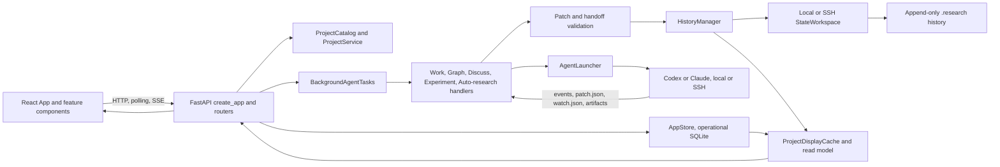

# RCP Architecture and Prompt Audit

## Conclusion

RCP has a strong canonical-state core, but the application around that core has
become an orchestration-heavy modular monolith. Four oversized surfaces —
`create_app`, `BackgroundAgentTasks`, `runs/work.py`, and frontend `App` —
coordinate overlapping state machines through nested closures, shared SQLite
access, post-construction snapshot completion, and reverse dependencies hidden
by local imports.

This audit is evidence and explanation, not the current implementation order.
The fact-checked and human-confirmed
[backend structural-refactor handoff](handoff-2026-08-18-backend-structural-refactor.md)
supersedes its remedies wherever they disagree.

## Status, fact-checked 2026-08-19

The original audit was run against an incomplete extracted copy. The current
fact check used committed checkout `f6085b0` and directly reran the relevant
source measurements. The complete baseline is healthy:

- `uv run pytest`: **2,204 passed** across **113 test files**;
- `uv run ruff check src tests`: passed;
- `npm --prefix web run build`: passed; and
- `npm --prefix web test`: **419 passed**.

Every originally reported missing file is present, including all eight Python
modules, `web/src/projectTransition.ts`, `web/src/experimentGuidance.ts`,
`docs/design.md`, and `docs/specs/`. The original missing-source finding, risk 1
in section 2, the dead-documentation finding in section 6, and P0 in section 10
are false for this repository.

The structural evidence required additional corrections rather than a blanket
"all findings hold":

- `create_app` is exactly lines 333–3278, with 99 direct child functions, 157
  local names, and 77 distinct application handlers owning 82 application route
  entries. Their median transitive closure reach is 2 names and the maximum is
  11; the file is structurally difficult, but an individual route does not
  usually reach the whole closure.
- `BackgroundAgentTasks` remains 3,916 lines and 70 methods. The old 45-policy,
  32-caller, and five-method/12-call boundary counts were not reproducible. The
  implementation handoff now assigns every method exactly once: 24 engine
  shells, 36 Auto-research policy methods, 4 Experiment policy methods, 2
  common episode/report methods, 1 branch-merge admission method, 2 watcher
  methods, and 1 shared authority resolver.
- `runs/work.py` is 5,207 lines with 88 module-level class/function definitions
  plus one private alias. Its internal call graph has no cyclic strongly
  connected component. The result-view cluster is the only retained exact
  ten-definition closed cluster; semantic ownership, not a speculative call
  graph partition, governs the rest of the split.
- `AppStore` exposes **242**, not approximately 246, public callable members
  across ten mixins and is referenced from 22 `src/rcp` files. Its breadth is
  real, but breadth alone did not establish a harmful transaction gap. The
  watcher examples named by the original audit already use compound atomic
  store operations.
- Project snapshot completion remains a real latent consistency hazard, but the
  current count is seven direct completion calls in `api/app.py` and two
  internal calls in `projects.py`, not eleven generic caller obligations.
- A current static import scan including function-local imports and package
  barrels finds five multi-module strongly connected groups, not the original
  three groups of sizes 11, 7, and 5. Section 2 records the current groups and
  the limits of that analysis.

**Reading this document without a software background.** Appendix A at the end
explains the five main structural findings from scratch. Its measurements and
causal claims were corrected during this pass; start there if sections 2, 3,
and 8 are hard to act on.

Two prompt findings were fixed, one was declined, and one was narrowed:

**Fixed: the write-authority contradiction (section 9, failure 1).** The Work contract now renders
the resolved `ProjectWriteScope` instead of describing it. `write_scope_section` in
[prompts.py](../../src/rcp/agents/prompts.py) builds the block from the same object that configures
the provider sandbox, so the prompt and the enforcement cannot disagree. It lists the writable
roots, the denied paths inside them, and states that a write outside them is a provider denial
rather than a permission the agent can request. It also says that a repository on another host is
outside the boundary, which the old prose blurred. The block appears in the standalone Work launch
contract, the Experiment-loop contract, and every Work turn envelope. The chat master context is
sent once and outlives any single resolution, so it points at the per-turn block instead of freezing
roots that can move. `CHAT_MASTER_CONTEXT_VERSION` was bumped so live sessions re-bootstrap.

**Fixed: over-anchoring examples (section 9, failure 5).** The fabricated "at least ten minutes"
threshold is gone; the criterion is now whether the work outlives the turn. The scheduler-specific
rule was rewritten as the general principle it always was — ask for the set of live work and test
membership, because a finished id and an unreachable service are usually reported the same way. It
now carries two worked examples, a scheduler job and a local process, both verified against the
watcher exit contract, and says outright that they show the exit contract rather than preferred
tools. The audit's own suggestion here was rejected: RCP does not probe the machine for `squeue` to
decide which examples to ship. Examples are examples, and shipping a few varied ones teaches the
class without any detection machinery.

**Declined: send only the active contract (section 9, failure 2).** The master context is read once
into the native session and stays there for the conversation, so withholding the inactive contract
saves a one-time cost while adding session state and invalidating a stable cached baseline. More to
the point, the design already trusts the turn marker to select the active contract. Building
machinery to physically withhold the other one contradicts that. This is invariant 10d in
[AGENTS.md](../../AGENTS.md) and it stands.

**Partly wrong: normative policy duplicated across prose and code (section 9, failure 4).** The
claim is right about the watcher protocol and about the Evidence `origin`, `role`, and `assessment`
enums, which the Patch JSON Schema already carries. It is wrong about the graph authoring rules more
broadly. The base relation endpoint table and the node id prefixes live in `RELATION_SPEC` in
[models.py](../../src/rcp/core/models.py), which is Python and never reaches the agent. The
materialized `ontology` field carries only extensions and is empty for a base project, and its
pointer is sent only when the project has extensions. So the prose table is the only place the agent
learns the base relations, and deleting it would break authoring. The two do currently agree, but
nothing keeps them agreeing — generating that block from `RELATION_SPEC` remains worth doing.

## Scope and verification boundary

The original extraction under `/mnt/data/repo_audit` contained approximately
111,000 source lines across 188 Python and frontend files, but it omitted
required source and documentation. Its 93 collection errors and five unresolved
frontend imports describe that extraction only and are not evidence about RCP.

The 2026-08-19 pass used the complete committed checkout. Under the explicit
`src/rcp/**/*.py`, `web/src/**/*.ts`, and `web/src/**/*.tsx` source set, it has
**118,276 lines across 200 files**. The pass used source tracing, Python and
TypeScript AST measurements, static imports including local imports, exact and
normalized-clone comparison, test collection, the full backend and frontend
suites, and the current design/specification hierarchy. Approximate decision
scores and prompt sizes whose original scripts or representative inputs were
not retained are labelled historical rather than silently recreated with a
different heuristic.

## 1. Primary dependency flows



The intended high-level split is documented in `README.md:20-50`: React owns the interface, FastAPI owns application behavior, and Tauri remains a thin operating-system shell. Operational records and caches live in app data, while canonical research state remains append-only under `.research` (`README.md:138-146`, `README.md:196-211`). That separation is sound.

### Canonical graph write flow

1. A human Sync, an agent Apply, a branch Apply, or a branch merge prepares
   typed initiating operations. Agent-produced operations arrive only through
   scratch `patch.json`.
2. `GraphTransitionManager` validates the initiating operations in written
   order, computes deterministic rule closure, and produces the expanded
   transition. Agent validation occurs during the run and Apply re-prepares
   against live current state.
3. A graph-writing run obtains the local or remote run lock. The local
   implementation uses `.agent-run.lock` and `flock`; the remote implementation
   uses an advisory holder process. Canonical mutation then enters the workspace
   transaction and append lock.
4. `HistoryManager.append` or `append_batch_from_state` rematerializes current
   state, validates, appends one exact-target revision, rematerializes, and
   publishes (`history/manager.py:484-600`, `history/manager.py:1055-1128`). A
   human draft may carry an expected-revision fence and is built from fresh
   state under the lock. Agent Apply has no original context-revision pin:
   graph movement alone is not rejection, because the operations are
   re-prepared and validated against current state.
5. Replay applies the recorded expanded operations without rerunning historical
   rules. The display read model is refreshed and returned to the UI.

This is the strongest lifecycle in the system. Freshness is checked under the same append lock used by writers, and canonical state is regenerated from history rather than edited independently.

### Agent task lifecycle

The durable task status model is `queued -> running -> pausing -> paused` or a terminal `succeeded`, `failed`, or `interrupted` state (`storage/models.py:202-216`). A task also carries a parent operation, episode, provider session, stage, graph target, write-scope fingerprint, phase, and receipts (`storage/models.py:280-315`).

The live lifecycle is spread across four layers:

1. An API route asks `BackgroundAgentTasks` to create a typed task record in SQLite.
2. `BackgroundAgentTasks._create_and_spawn` performs admission, parent/episode binding, continuation checks, and worker creation (`background.py:3136-3312`).
3. A worker thread calls `_run`, which creates a new event loop with `asyncio.run`, invokes `_consume`, updates durable status, triggers callbacks, and cleans up (`background.py:3622-3779`).
4. `_consume` decodes provider frames, checkpoints session identity, stores usage and receipts, accumulates graph updates and artifacts, and translates pause/error events (`background.py:3870-4006`).

The persistence is useful, but the lifecycle is not represented as one explicit transition system. It is reconstructed through branches in `BackgroundAgentTasks`, run handlers, storage methods, and callbacks defined inside `create_app`.

### Episode and Auto-research lifecycle

Episodes are mode-neutral durable parents with statuses `queued`, `running`, `stopping`, `wrapping_up`, `needs_action`, `completed`, `stopped`, and `failed`; wrap-up has a second state machine (`storage/models.py:398-447`). Auto-research adds branch identity, child admissions, mail, lifecycle notices, merge eligibility, and report generation. Experiment loops add invocation budgets, watcher delivery, provider-session continuity, attempt bookkeeping, and human pause conditions.

Startup performs a long reconciliation sequence before the application yields: reserved roots, committed dispatches, child admissions, orphaned failures, lifecycle and mail, every Auto-research and Experiment episode, recovery passes, graph conditions, and watcher workers (`api/app.py:1108-1195`). This is evidence that the state is durable, but also that its invariants are distributed enough to require a large boot-time repair program.

### Watcher lifecycle

A Work or Experiment agent writes `watch.json`. RCP validates and persists either external observers or canonical graph conditions. Watchers move through `active`, `degraded`, `completed`, or `stopped` (`storage/models.py:1096-1096`, `storage/models.py:1206-1253`). External checks are polled; graph conditions are evaluated at accepted graph boundaries and startup. A completed group is atomically claimed, creates a continuation task, and is marked notified.

Watcher identity includes the originating task, chat, optional episode, graph target, execution host, and a full continuation profile (`storage/models.py:1124-1147`, `storage/models.py:1206-1244`). This makes a watcher durable, but also turns it into a second task-dispatch envelope that duplicates much of the agent-task state.

### Human draft and transition lifecycle

The frontend keeps canonical project state, a `HumanDraft`, transition head, ruleset tag, manifest, preview projection, sync fences, and local-storage persistence in `App` (`web/src/App.tsx:670-689`). `syncHumanDraft` is a 185-line transaction coordinator that:

- rejects sync under several local and canonical conditions;
- normalizes a draft and creates an expected-head fence;
- tracks the request in a transition coordinator reducer;
- posts the sync;
- decides whether a response may still be applied to the active tab;
- reloads canonical state after stale or displaced responses;
- reconciles retained local draft state and transition manifests;
- clears the in-flight fence (`web/src/App.tsx:2186-2370`).

`web/src/projectTransition.ts` contains the central reducer and routing functions
imported by `App`. It is present, covered by focused reducer, presentation, and
integration tests, and was included in this pass. The concentration in `App`
remains real; incompleteness is not part of the finding.

### Read-model and cache lifecycle

`ProjectService.project_snapshot` combines canonical graph, paper, configuration, and default experiment controls (`service.py:907-983`). It cannot read operational task state. `ProjectDisplayCache.attach_experiment_control` therefore mutates every outgoing snapshot with live episode/task data. Its own docstring warns that any route which forgets this step can blank the Experiment lifecycle shown to the user (`projects.py:1425-1436`). This is a direct consistency hazard between canonical and operational state.

## 2. Highest-risk dependency points

| Rank | Risk                                                | Why it is high risk                                                                                                                                                                                                                                                                                                                                                 |
| ---: | --------------------------------------------------- | ------------------------------------------------------------------------------------------------------------------------------------------------------------------------------------------------------------------------------------------------------------------------------------------------------------------------------------------------------------------- |
|    1 | `api/app.py:create_app`                             | At 2,946 lines it is the DI container, route registry, startup/shutdown coordinator, cache assembler, task dispatcher, episode recovery coordinator, watcher bootstrap, and home of 77 application handlers. The former 441-point score is historical because its heuristic was not retained.                                                                       |
|    2 | Implicit durable-task and episode policy            | `BackgroundAgentTasks` is a 3,916-line class with 70 methods. It coordinates SQLite status, threads, per-thread event loops, provider sessions, stages, episodes, watchers, callbacks, and recovery. The 66 literal `lost its …` guards span 19 files, but many protect immutable bindings rather than task status, so the phrase count is not a causal classifier. |
|    3 | Split canonical/operational project snapshots       | A `ProjectSnapshot` looks complete but is not. Seven route-level and two internal paths currently complete it after graph-only construction; omission can erase visible lifecycle state.                                                                                                                                                                            |
|    4 | Frontend `App` as a mega-controller                 | `App` still spans exactly 3,319 lines and owns routing, project tabs, identity, desktop lifecycle, canonical reconciliation, local drafts, transitions, task launch, chats, graph panels, paper, watchers, and dialogs (`web/src/App.tsx:567-3885`). `projectTransition.ts` exists and is tested.                                                                   |
|    5 | Reverse architectural dependencies                  | There are no demonstrated top-level import crashes, but a scan including local imports and package barrels produces five strongly connected groups. This is dependency-direction evidence, not proof that every member should be merged or moved together.                                                                                                          |
|    6 | Operational SQLite as a broad single failure domain | Corruption or migration failure does not destroy canonical `.research` truth, but it can simultaneously affect identity, memberships, tasks, episodes, watchers, result views, and caches. `AppStoreBase._initialize` remains a 1,158-line schema/bootstrap/migration function (`storage/base.py:125-1282`).                                                        |
|    7 | Broad `AppStore` surface                            | `AppStore` exposes 242 public callable members over one SQLite file. That makes reach broad, but the original audit did not prove that this shape itself caused a partial commit; the post-Phase-1 harmful-sequence audit in the implementation handoff is the gate.                                                                                                |

### Circular dependency groups

The current scan treats every `src/rcp` Python module as a node, includes imports
inside functions, and resolves an import through a package `__init__` as an edge
to that package barrel. It finds five non-trivial strongly connected groups:

1. **Validation, authority, provider, and transport — 21 modules:**
   `agents.context`, `agents.write_scope`, `config`, `core.authority`,
   `core.materialize`, `core.transitions`, the `core.validation` barrel plus
   `approval`, `experiment_loop`, `nodes`, `ops`, `patch`, `proposals`, and
   `registry`, `history.delta`, `providers`, the `transport` barrel plus
   `repositories`, `run_stage`, `state`, and `workspace_mailbox`.
2. **Run orchestration — 12 modules:** the `agents` barrel,
   `agents.acceptance`, `background`, `runs.auto_research`,
   `runs.auto_research_recovery`, `runs.branch_merge_request`,
   `runs.episode_report`, `runs.episode_wrapup`, `runs.experiment_admission`,
   `runs.shared`, `runs.task_policy`, and `service`.
3. **Storage/watcher reconciliation — 6 modules:**
   `runs.transition_event_reconciliation`, the `storage` barrel,
   `storage.base`, `storage.experiments`, `storage.watchers`, and `watchers`.
4. **Core model/operation pair — 2 modules:** `core.models` and
   `core.operations`.
5. **History branch/manager pair — 2 modules:** `history.branches` and
   `history.manager`.

These are not immediate import crashes: many reverse edges are delayed and some
exist only because a package barrel is counted as a module. The result does show
that dependency direction is not clean, but it does not by itself prescribe a
module split. The old 11/7/5 groups should not be reused.

## 3. Three structural pressure points

### 1. `ProjectService` plus mutable `ProjectSnapshot`

The abstraction claims to be a project-facing service and read model, but it
cannot assemble the operational truth needed by the UI.
`ProjectService.project_snapshot` supplies graph-derived experiment controls
(`service.py:934-938`), then `ProjectDisplayCache` overwrites them with
SQLite-derived task and episode state. A route can return a validly typed but
semantically incomplete snapshot. Seven direct completion calls in `app.py` and
two internal calls in `projects.py` currently maintain the convention.

The branch abstraction leaks in the same way. `ProjectService.for_graph_target` creates a second full `ProjectService` around a branch-specific `HistoryManager`, while retaining paper, launcher, provider skills, and repository inventory (`service.py:654-681`). A graph target should be an explicit parameter of graph queries and commands, not a reason to clone a broad service object.

The observation that `for_graph_target` clones a broad service remains true,
but this audit did not demonstrate a bug from that choice and the current
structural handoff deliberately excludes `service.py`.

**Confirmed replacement:** the graph-only builder returns an opaque,
non-serializable internal draft. One display/I/O boundary completes either a
fresh draft or a saved backend snapshot with current operational control and
returns the public serializable form. This makes completeness unavoidable
without introducing a new broad read-model layer.

### 2. `AppStore` as a mixin-composed whole-system API

The mixins improve file size only. They do not create bounded contexts, ownership, or interfaces. `AppStore` exposes spaces, projects, result views, episodes, Auto-research, children, experiments, watchers, tasks, and row mapping as one object (`storage/__init__.py:26-43`). Any orchestration module can reach any table through the same dependency.

Every connection context auto-commits (`storage/base.py:115-123`), so two store
calls are two commits unless a compound method deliberately owns one
transaction. That is a risk pattern, not proof that every multi-call sequence is
wrong. The original watcher examples already use compound atomic methods, and
some episode flows intentionally persist a fence before later settlement so
recovery can observe it.

**Disposition:** splitting `AppStore` into repositories was rejected. After the
Phase 1 lifecycle fix, audit caller-level multi-commit sequences for one named
invariant that a crash between commits can violate. Add a narrow compound store
method and failure-injection test only for a proven case. If none qualifies,
make no Phase 3 code change.

### 3. “Agent task” as an implicit distributed state machine

A task is nominally one record, but correctness depends on coordinated identity across an operation ID, parent operation, episode, graph target, stage root, provider-native session, write-scope fingerprint, watcher group, lifecycle mail, and receipts. Request kind is mapped repeatedly through `if`/`isinstance` branches, including `_request_from_record` and `_validate_request_type` (`background.py:4141-4169`). `create_app` then redispatches the same kinds through a large nested stream function (`api/app.py:623-824`).

**Disposition:** the generic `RunEnvelope`/handler-registry replacement was
rejected because these policies have different contracts. One-invocation
executors move under `runs/tasks/`; long-lived parent policy moves under
`runs/episodes/`; ordinary Work, Experiment-loop, and Auto-research child Work
keep explicit entry points. `BackgroundAgentTasks` launches an already-admitted
durable `operation_id`, while the existing `EpisodeReconciler` receives an
ID-only settlement notification and reloads durable state. Shared plumbing is
allowed, but it may not select policy using `kind`, `surface`, `is_chat`, or an
equivalent discriminator.

## 4. Most difficult modules for a new senior engineer

1. **`src/rcp/api/app.py`**. There is no clean composition boundary. Understanding one route can require following nested closures that capture the catalog, store, cache, background tasks, episode coordinators, locks, and watcher registries.
2. **`src/rcp/background.py`**. It contains the actual durable task lifecycle, admission, recovery, pause/resume/retry, thread ownership, event-loop ownership, and settlement semantics.
3. **`src/rcp/runs/work.py`**. At 5,207 lines, it combines turn resolution, staging, prompt composition, watcher maintenance, live correction mailboxes, patch validation, Work commit, Experiment-loop commit, Auto-research child mail, result views, and finalization.
4. **`src/rcp/storage/base.py` plus the storage mixins**. A new engineer must infer schema versions, migration invariants, and cross-table relationships from a 1,158-line initializer and hundreds of methods spread across topic files.
5. **`src/rcp/history/manager.py` and `src/rcp/transport/state.py`**. These encode the most important correctness boundary, including local/SSH snapshots, publication leases, run locks, append locks, repair, replay, and remote failure reconciliation.
6. **`web/src/App.tsx` and `web/src/projectTransition.ts`**. The frontend has
   both server state and local transaction state, with stale-response and
   multi-tab handling concentrated in `App`; the reducer module exists and is
   covered by focused tests.
7. **The prompt stack**, especially `agents/prompts.py`, `agents/experiment_loop_prompt.py`, and `agents/auto_research_prompt.py`. Backend authority, provider capability, watcher schema, graph ontology, continuation semantics, and examples are duplicated across long prose contracts.

`docs/design.md`, `docs/specs/`, `docs/decisions/`, current acceptance scenarios,
and current handoffs now provide the authority hierarchy that the extraction
lacked. `AGENTS.md` is 76,927 bytes and intentionally remains the canonical
agent instruction file; its size is an onboarding cost, not missing design
authority.

## 5. Historical rewrite directions and current disposition

I would retain Python, FastAPI, React, Tauri, SQLite, structured patch files, provider-enforced write boundaries, and append-only canonical history. The main problems are structural, not language choices.

### Application kernel — not selected

The original recommendation was to put `create_app` under roughly 100 lines,
instantiate an `ApplicationKernel`, include routers, and add separate
`StartupReconciler`, `RunDispatcher`, and `WatcherRuntime` objects. The line
target was judgment, not a measured requirement, and those wrapper objects were
not selected. The confirmed change extracts route modules, stores one typed
`ApiServices` composition container at `app.state.services`, and gives handlers
narrow dependency accessors. The existing `EpisodeReconciler` owns episode
startup/settlement; no second coordinator is added.

### Generic command/event kernel — not selected

The audit proposed a lightweight durable workflow model in the existing SQLite
database:

- API and watcher inputs produce typed commands.
- A transition function validates current state and writes one transaction containing state changes and an outbox effect.
- A bounded async supervisor executes effects.
- Completion produces typed events that pass through the same transition function.

This does not require Temporal or another service, but it is still a new runtime
framework. The confirmed plan instead adds one narrow durable boundary:
admission writes the exact launch intent atomically, the engine exposes
`launch_admitted(operation_id)`, and task settlement notifies
`EpisodeReconciler` by ID after committing the verdict. Startup reconciliation
repairs a crash before notification.

### Split the storage façade — rejected

The audit proposed `TaskRepository`, `EpisodeRepository`, `WatcherRepository`,
`ProjectRepository`, and `IdentityRepository`, plus an explicit `UnitOfWork`.
That is not the implementation plan. Keep the composed `AppStore`; add a narrow
compound method only when the Phase 3 audit proves a harmful crash window.
Numbered migrations remain a separate possible cleanup, not an authorized phase
of the backend structural refactor.

### Joined read-model service — narrowed

Canonical graph state and operational runtime state remain intentionally
distinct, but the confirmed fix does not add `GraphQueryService`,
`OperationsQueryService`, and `ProjectReadModelAssembler`. It uses one opaque
graph-only draft and one completion boundary returning the public snapshot. The
important property is that an incomplete value cannot be serialized or reach a
route, not the number of new service objects.

### Run-handler registry — rejected

The audit proposed a discriminated `RunEnvelope` whose `kind` selects a
`RunHandler` with this uniform lifecycle:

```text
admit -> stage -> build_contract -> execute -> read_handoff -> validate -> commit -> settle
                                      \-> pause/fail/recover
```

Common provider event decoding, receipts, cancellation-safe owned tasks, lock
observation, staged-file cleanup, and finalization may remain shared primitives.
The registry and uniform policy lifecycle are rejected: explicit task entry
points and explicit Auto-research/Experiment episode algorithms keep their
different contracts visible.

### Frontend ownership — outside the confirmed backend refactor

The audit proposed making `App` a route/shell composer, adopting a server-state
cache such as TanStack Query, keeping transition state in one project-keyed
reducer/store, moving `syncHumanDraft` into a typed command object, and
generating more TypeScript contracts from OpenAPI. These remain unselected
frontend proposals. The current handoff changes `web/` only as needed to
preserve behavior while the backend structure moves.

### Generate prompt prose — partly selected

The task message now renders the exact provider-enforced write roots and
protected paths, and generating the base relation block from `RELATION_SPEC`
remains a valid narrow candidate. Sending only the active chat contract was
explicitly declined under invariant 10d. A broad rewrite of every watcher,
patch, command, and continuation description is not part of the confirmed
backend refactor.

### Dependency direction — diagnostic, not an authorized phase

Ban internal imports from package barrels such as `rcp.storage`, `rcp.agents`, and `rcp.core`; import leaf modules instead. Add import-linter rules for layers such as:

```text
api -> application -> domain
application -> repositories/providers/transport
repositories/providers/transport -> domain
frontend shell -> features -> API/types
```

Local imports should not be used merely to conceal reverse architectural
dependencies. The five current SCCs are evidence for review during the selected
module moves; an import-linter dependency and repository-wide barrel ban are
not part of the confirmed work.

## 6. Premature abstractions, dead options, and unreachable defenses

### High-confidence findings

- **The storage mixin split reduces file length, not API breadth.** The package
  says so directly (`storage/__init__.py:1-6`), and `AppStore` still exposes 242
  public callables. Calling that breadth "cosmetic" overstates the consequence:
  the topic files do provide code ownership, and no broad repository split is
  authorized without a proven transaction failure.
- **`_LazyProjectService` is a compatibility façade.** It exists to make `app.state.service` lazily expose the default project (`api/app.py:316-330`, `api/app.py:1217-1225`). Source use is dominated by tests. Production code is already project-ID and catalog based. Remove it from the production application surface and provide a test fixture helper.
- **`Manifest.execution` and `paper.coach` are legacy migration inputs, not current configuration.** They are consumed to synthesize profiles (`config.py:171-194`) and removed on write (`config.py:467-473`). Isolate them in a versioned manifest migration loader instead of carrying them in the live model.
- **`AgentSurfaceConfig.permissions` appears configurable but is derived policy.** Missing values are filled with `permissions_for(surface)`, and any widening or narrowing is rejected (`config.py:212-228`). The writer always serializes the derived policy (`config.py:461-465`). Either omit it from user configuration or store only a policy version/digest.
- **An old-client compatibility branch is unreachable through the current API.** `write_agent_settings` says omitted surfaces are preserved (`config.py:449-455`), but `ProjectSettingsRequest` rejects any request that does not include every surface (`service.py:584-593`), and the route passes that model directly (`api/app.py:1941-1954`). Remove the branch or actually support partial updates.
- **The documentation hierarchy is live.** `docs/design.md`, `docs/specs/`,
  `docs/decisions/`, active acceptance scenarios, and current handoffs all exist
  and are checked by `tests/test_documentation.py`. The original dead-reference
  finding was solely an extraction artifact.

### What I did not find

A token-level static scan found no high-confidence top-level private Python
function that is defined only once and never referenced in source or tests.
That does not prove there is no dead code; dynamic registration and imports make
token counts incomplete. The full checkout does build and test, so missing
modules are no longer a limitation on this statement.

### Defensive code assessment

The `bootstrap_code is None` branch in `storage/base.py:111-112` is mechanically impossible when `issue_bootstrap=True`, but it is a harmless invariant assertion and should become an explicit `assert` or invariant helper, not a priority deletion.

The 66 literal `lost its …` guards across 19 files are not impossible scenarios
and should not be swept away. Many protect immutable session, branch,
allocation, or snapshot bindings rather than task-status transitions. Their
frequency shows a large invariant surface, but does not prove that one generic
lifecycle abstraction should replace the distinct policies. Phase 1 audits
only guards whose fact can be returned atomically by the new transition seam.

## 7. Reimplemented logic and consolidation targets

### Exact or near-exact duplicates

- `_prepare_worker_handoffs` and `_prepare_orchestrator_handoffs` have identical
  bodies but distinct typed signatures; they are not byte-identical functions.
  Keeping the actor roles explicit is consistent with the current policy.
- `_wait_for_owned_task` and `_wait_for_work_validator_task` have the same
  cancellation-safe algorithm, with different names and docstrings
  (`runs/auto_research_stream.py:1581-1599`, `runs/work.py:4700-4718`). This is a
  plausible shared-plumbing leaf, not an authorized new runtime abstraction.
- `_record_run_lock_wait` and `_record_work_lock_wait` are normalized-AST
  identical (`runs/graph.py:1177-1194`, `runs/work.py:4959-4976`). Their
  corresponding lost-lock functions deliberately differ, so a broad
  `CanonicalLockObserver` was not established by this clone alone.
- At the audited baseline, `_result_view_id` was duplicated byte for byte in the
  result-view task module and `transport/run_stage.py`. Phase 4a subsequently
  centralized it as `validate_result_view_id` in `rcp.artifacts`; the result-view
  caller now lives in `runs/tasks/result_views.py`. This was the one confirmed
  Phase 4 move, not permission for a duplicate sweep or a new value type.
- User-ID and graph-condition nonblank validators are repeated in `storage/models.py:65-71`, `storage/models.py:109-115`, `storage/models.py:1157-1173`, and `storage/models.py:1191-1197`.
- Directory fsync helpers at `projects.py:1820` and `history/manager.py:1609`
  have normalized-AST-identical bodies but different method/function shapes.
- Prompt pointer helpers `_pointer` and `_optional_pointer` at
  `agents/prompts.py:121` and `agents/auto_research_prompt.py:43` have
  normalized-AST-identical bodies. Neither leaf duplicate is part of the
  confirmed refactor.

### Semantic duplicates

- **Live patch validation:** Graph and Work each parse, shape-check, prepare,
  call `history.validate_candidate`, map unavailable/invalid states, collect
  reject messages, and construct `PatchValidationResult`. Shared leaf plumbing
  is acceptable, but a helper taking `kind`, `surface`, or a message-policy
  discriminator would violate invariant 10. The original generic primitive is
  not the confirmed design.
- **SSE event decoding:** `background.py:4177-4184`, `runs/episode_report.py:669-672`, and several Work, Graph, and Auto-research loops each decode `data:` frames independently. Use one strict `decode_agent_event_frame` function.
- **Run-kind dispatch and request validation:** task kind is interpreted in
  `create_app`, `BackgroundAgentTasks`, and `runs/task_policy.py`, with repeated
  `isinstance` checks. The confirmed replacement is admission-time authority
  resolution plus explicit task and episode entry points, not a discriminated
  envelope or handler registry.
- **Watcher protocol:** watcher shapes and exit semantics appear in typed models
  and several prompts. The stable three-way exit protocol already has runtime
  and prompt tests, so a shared prose renderer was explicitly struck from Phase 4. Broader schema generation would require separate evidence and scope.
- **Settlement and receipt handling:** Work, Graph, Discuss, Auto-research, and
  report runs repeat some provider-stream and cleanup mechanics. Shared plumbing
  remains desirable where it is policy-neutral; one `AgentTurnRunner` with
  policy hooks would recreate the rejected runtime framework.

## 8. Highest cognitive-complexity functions and decomposition

Every line span below reproduces against `f6085b0`. The decision-point and
frontend branch-token numbers came from the original audit's AST heuristic, but
its exact scoring script was not retained. They are historical relative ranks,
not reproducible implementation thresholds.

| Function                                                      | Lines | Historical decision points | Original decomposition suggestion                                                                                                         |
| ------------------------------------------------------------- | ----: | -------------------------: | ----------------------------------------------------------------------------------------------------------------------------------------- |
| `api/app.py:create_app`                                       | 2,946 |                        441 | `ApplicationKernel`, routers, `RunDispatcher`, `StartupReconciler`, watcher runtime, serialization/read-model helpers                     |
| `core/materialize.py:_apply_patch`                            |   255 |                         56 | One operation handler per operation type, each returning state plus emitted bookkeeping; dispatch table instead of nested branching       |
| `runs/graph.py:stream_graph_run`                              |   687 |                        124 | stage inputs, compose prompt, stream provider, correct handoff, commit patch, finalize result                                             |
| `history/delta.py:_operation_fallbacks`                       |    92 |                         38 | A formatter registry keyed by operation type; pure formatter per operation                                                                |
| `runs/discuss.py:stream_discuss_run`                          |   505 |                         73 | shared turn execution, Discuss-specific context policy, artifact settlement, transcript commit                                            |
| `runs/auto_research_effects.py:auto_research_command_effects` |   732 |                        129 | parse command, authorize, execute each command type, reconcile unknown outcomes; use command handlers and an effect result algebra        |
| `service.py:ProjectService._build_sync_patches`               |   362 |                         87 | normalization, ontology edits, node creation, node updates, removals, proposal judgments, conflict detection, patch aggregation           |
| `runs/work.py:_process_experiment_watcher_maintenance`        |   293 |                         35 | parse requested watcher changes, bind episode, stop/rearm, validate joint handoff, produce one typed maintenance plan                     |
| `background.py:BackgroundAgentTasks._create_and_spawn`        |   177 |                         55 | admission policy, durable creation, recovery binding, worker scheduling; delegate by handler and persist one transition                   |
| `agents/launcher.py:AgentLauncher.stream`                     |   234 |                         57 | provider resolution, local/SSH setup, capability/write-scope enforcement, process stream, cleanup; split transport from provider protocol |

Frontend concentration is similar:

| Component/function    |        Span | Approx. branch tokens | Decomposition                                                                                                   |
| --------------------- | ----------: | --------------------: | --------------------------------------------------------------------------------------------------------------- |
| `App`                 | 3,319 lines |                   608 | route shell, project-session provider, transition provider, task launcher, desktop shell, feature pages         |
| `NodeChat`            | 1,373 lines |                   280 | transcript model, input composer, task/run state, artifact/result-view panel, presentation                      |
| `DetailDrawer`        |   718 lines |                   136 | node schema adapter, editable field groups, proposal controls, relation view, presentation                      |
| `ExperimentRunDetail` |   366 lines |                   100 | runtime summary selector, watcher state, controls, report/results, presentation                                 |
| `PaperWorkspace`      |   602 lines |                   129 | paper query state, editor, coach session, artifact/preview state                                                |
| `syncHumanDraft`      |   185 lines |                    39 | precondition reducer, sync command, stale-response disposition, canonical reload, draft rebase, UI notification |

The decomposition should favor pure phase functions and typed intermediate
values. The sequence below remains a useful description of shared Work
mechanics, but task dispatch must now select explicit ordinary-Work,
Experiment-loop, or Auto-research-child entry points before those mechanics;
`stream_work_run` must not retain a mode switch:

```text
resolve_turn
stage_turn_inputs
select_prompt_delta
execute_provider_turn
read_deliverables
validate_handoff
commit_graph_effect
commit_watcher_effect
finalize_conversation
```

Each phase should accept and return a typed value rather than mutate an `AgentTaskExecution` object and several storage records opportunistically.

## 9. Prompt construction audit from the receiving agent's perspective

### Representative prompt size

The original audit rendered representative paths and one repository, with no
large graph or repository content embedded. The exact input fixture was not
retained, so these values are historical and were not presented as current
measurements in the 2026-08-19 fact check:

| Contract                       | Characters | Approx. tokens | Lines |
| ------------------------------ | ---------: | -------------: | ----: |
| Discuss                        |      3,926 |            982 |    80 |
| Work                           |     17,208 |          4,302 |   230 |
| Chat master, Discuss plus Work |     21,866 |          5,466 |   325 |
| Auto-research orchestrator     |     12,171 |          3,043 |   170 |
| Experiment loop                |     30,069 |          7,517 |   380 |

Token estimates use characters divided by four and are directional. They exclude task-specific files, graph records, repository instructions, prior messages, skill packages, diagnostics, and tool output.

### What is strong

- The authority boundary is unusually clear: the human request cannot widen the contract, repository content is evidence rather than authority, and repository-local instructions are subordinate method constraints (`agents/prompts.py:26-32`).
- Human-authored message bytes are deliberately preserved unchanged (`agents/prompts.py:542-549`).
- Graph changes use a structured file and schema, never prose parsing. The backend revalidates before append.
- Work and orchestrator launches require a resolved write scope, bind its fingerprint to the durable task, and record the provider enforcement mode (`runs/shared.py:405-451`). Codex and Claude both fail closed when the requested capability cannot be enforced (`providers.py:332-350`, `providers.py:690-765`).
- Discuss is genuinely narrower. It prohibits project writes and graph patches and limits writes to conversation scratch (`agents/prompts.py:798-856`).

### Main agent-facing failures

#### 1. The prompt declares broader write authority than runtime provides

**Fixed 2026-08-18. See the status section above.** The description below is the original finding.

The old Work contract said RCP imposed no repository allowlist and that
repository pointers were not a filesystem permission boundary. The provider
layer required `write_dirs` to equal the resolved repository roots and permitted
writes only in those roots while denying protected paths.

From the agent's perspective, a contract-authorized action could therefore fail
as an unexplained tool denial. `ProjectWriteScope` and
`agents/write_scope.py` are now present, tested, and rendered into the active
Work-like launch or turn; the extraction's missing-file limitation was false.

#### 2. The stable chat context includes an inactive contract

**Declined 2026-08-18. See the status section above.**

`chat_master_context` embeds both complete Discuss and Work contracts and asks later turns to follow only the selected one (`agents/prompts.py:553-643`). This spends roughly 5.5k tokens before conversation context and creates mode interference. A Discuss turn still contains detailed Work, patch, watcher, and repository-write instructions in context.

The original recommendation was to send only the active contract and cache
policy server-side. Do not implement it: invariant 10d intentionally uses one
stable master containing both contracts and a per-turn marker that activates
exactly one.

#### 3. The task plane is buried under control-plane protocol

A Work agent must understand RCP ontology extensions, graph causal checks,
proposal authority, source refs, patch schema, watcher lifecycle, validation
correction, artifact rules, repository instructions, and session continuation
before doing the user's operation. The original representative Experiment
rendering was 380 lines; that exact rendering is not reproducible without its
missing input fixture.

This makes “satisfy the orchestration protocol” a competing objective with “solve the human's task.” It also increases the chance that a scientifically or operationally correct result is rejected for a small handoff-format mistake.

The direction remains plausible, but it is not a fact or a confirmed phase.
RCP already stages a validator client and typed command clients for several
mechanically checkable paths. Any further move requires a separately scoped
contract change rather than being folded into the structural refactor.

#### 4. Normative policy is duplicated across prose and code

**Partly wrong. See the status section above: the graph authoring rules are mostly not duplicated.**

Watcher shape and semantics are present in storage models, Work prompt, Experiment prompt, wake prompt, and correction prompts. Graph authority is centralized better, with a version and digest, but surrounding authoring rules are repeated. Drift is already visible in the filesystem-boundary contradiction.

Do not turn this into a blanket prompt generator. The watcher exit mapping is
small, stable, and covered by runtime plus prompt tests. Generate the base
relation block from `RELATION_SPEC` only if that narrow change is separately
accepted; it is changing computed policy that otherwise has no agent-visible
representation.

#### 5. Examples over-anchor the model

**Fixed 2026-08-18, but not as recommended here. See the status section above.**

Experiment wake guidance says detached work is “typically” Slurm or work expected to take at least ten minutes and includes a literal Slurm command (`agents/experiment_loop_prompt.py:443-468`). The initial contract repeats the same scheduler-specific pattern. Models often treat repeated examples as policy. The result may be inappropriate Slurm assumptions, a fabricated ten-minute threshold, or unnecessary watcher use.

Examples should be explicitly non-normative. ~~and selected from detected project context~~ — this
part was rejected: probing the machine to decide which examples to ship is machinery in place of
writing. Ship a few varied examples and label them.

#### 6. Repository instructions can be large, but remain authoritative

Work tells the model to read `AGENTS.md` and `CLAUDE.md` at every repository
root before changing that repository (`agents/prompts.py:1017`). In this
repository, `AGENTS.md` is 76,927 bytes, but its design/specification references
are present and current. Repository instructions are a deliberately subordinate
method-constraint layer, not stale product authority.

The proposed instruction digest was not accepted. A digest could silently omit
the exact repository-owned constraint relevant to a write. Reducing instruction
size would need its own fidelity contract and evidence; it is not part of this
handoff.

### Historical prompt recommendations and disposition

1. **Exact authority envelope:** partly implemented through
   `ProjectWriteScope`, provider capability, authority version/digest, and
   protected paths. The 300–600-token target was never measured as a
   requirement.
2. **One active mode contract:** declined. Invariant 10d intentionally sends the
   stable Discuss and Work contracts once, then activates exactly one with the
   per-turn marker.
3. **Unchanged human objective:** already implemented; human-authored message
   bytes remain untouched.
4. **Machine-readable context and deltas:** durable context snapshots and
   compact replacement deltas already carry the revision, graph target,
   repositories, packages, and session binding.
5. **Typed actions:** Auto-research command clients and the staged Patch
   validator implement part of this direction. A general tool conversion is
   unconfirmed.
6. **Generated validation guidance:** potentially useful for the base relation
   table; not a blanket prompt rewrite.
7. **Delta continuation prompts:** already the chat protocol. New provider
   sessions receive the master; resumes receive the marker, human message, and
   changed context.
8. **Non-normative varied examples:** implemented for external watcher checks;
   no tooling-detection machinery is added.

## 10. Prioritized remediation

### P0: Restore a trustworthy baseline

**Does not apply to this repository.** Nothing was missing; the audit was run on a bad extraction.
See the status section at the top.

### P1: Remove the largest consistency hazards

- Add the Phase 0 route and lifecycle safety nets, then centralize the legal
  agent-task status transitions and their guarded side effects in one private
  storage seam.
- Replace serializable half-built snapshots with an opaque internal draft and
  one public display/I/O completion boundary.
- Extract route modules through one typed `ApiServices` composition container
  and narrow dependency accessors; do not add an application-kernel business
  layer.
- Separate one-invocation task execution under `runs/tasks/` from parent policy
  under `runs/episodes/`, reuse the thin `EpisodeReconciler`, and reduce
  `BackgroundAgentTasks` to the exact 24 policy-neutral engine shells.
- Audit harmful multi-commit sequences after the lifecycle fix and add only
  proven compound operations. Do not split `AppStore` pre-emptively.

### P2: Reduce change cost

- Frontend `App` and `NodeChat` remain substantial future candidates, but the
  confirmed handoff is backend-only and changes `web/` only to keep behavior
  working.
- Consolidate only policy-neutral leaf plumbing. The one verified immediate
  duplicate is the result-view id validator; the watcher renderer and generic
  run-handler framework are rejected.
- Numbered migrations and import-layer rules remain separate possible work, not
  part of the current implementation order.
- ~~Render the exact provider scope into the prompt.~~ Done 2026-08-18. Generating the rest of
  the prompt contracts from runtime policy is still open, starting with the relation table.

## Final assessment

The application is not architecturally unsalvageable. Its most important
invariant, append-only canonical research state with locked validation and
rematerialization, is coherent and should be preserved. The backend next step
is the exact phased work in the structural handoff: transition safety,
non-serializable snapshot drafts, narrow route extraction, semantic task/episode
ownership, and a policy-neutral background engine. `App.tsx`, broad storage
interfaces, a generic run registry, and wholesale prompt redesign are not part
of that authorization.

## Appendix A: the five structural findings, explained from scratch

This appendix restates the main structural findings for a reader who is not a
professional software engineer. It defines every term it uses and grounds each claim in
code from this repository. The technical sections above are the reference; this is the
explanation. Every number here was rechecked against committed checkout
`f6085b0` on 2026-08-19 unless explicitly labelled historical.

The single thread through all five: none of it is bad code, and all of it works today.
The cost is that each one makes information **not local** — to answer a simple question
about one piece, you must go read several other pieces.

### A1. A file with no seam (`api/app.py`)

**The concept.** A function is a named block of code you can run. Normally it knows two
kinds of names: the ones handed to it, and the ones it creates itself.

```python
def add_tax(price):
    rate = 0.08
    return price * (1 + rate)
```

`price` was handed in. `rate` was made inside. Read those three lines and you know
everything this function uses. Nothing outside can change the answer.

Python lets you put a function inside another function. When you do, the inner one can
also use names from the outer one without being handed them.

```python
def make_calculator(rate):
    def add_tax(price):
        return price * (1 + rate)   # rate is not defined in here
    return add_tax
```

`add_tax` uses `rate`, but `rate` appears nowhere inside it. It comes from the function
wrapped around it. A function that reaches outward like this is called a **closure**.
That is all the word means: a function that carries names from the code surrounding it.
It is a normal, useful feature. The problem is what happens when the surrounding
function is 2,900 lines long.

**In this repository.** Here is a real route, eight lines, at
[app.py:1455](../../src/rcp/api/app.py):

```python
@app.get("/api/team/invitations")
def team_invitations(request: Request) -> list[dict[str, object]]:
    require_team_space()
    member = acting_user(request)
    return [
        invitation.model_dump(mode="json")
        for invitation in store.team_invitations(member.user_id)
    ]
```

It uses three names. None is defined in those eight lines, and none is imported at the
top of the file. All three are reached from outside: `store` at line 353,
`require_team_space` at line 362, `acting_user` at line 367 — about 1,100 lines earlier.

**The natural objection.** You can simply scroll to the route and read it.

You can. What you cannot do is answer anything about it. Is `store` the database, a
cache, something read-only? When `require_team_space` fails, does it return, raise, or
redirect? The eight lines do not say. You go find each one.

**The cost.** Look at the signature: `def team_invitations(request: Request)`. It
declares that this function takes one thing. It also touches the database and the
identity system, and says so nowhere. **The function's header understates what the
function reaches.** That makes direct isolated testing harder; current route tests
usually construct the application so the closure exists rather than inject the route's
two narrow services.

**The scale.** `create_app` defines **157 local names** and **99 direct child
functions**. This does not mean every child reaches all 157. The 77 application
handlers collectively close over 31 distinct names; median transitive reach is 2 and
the maximum is 11. The problem is hidden declaration and one shared edit surface, not
that every route has broad runtime reach. A seam is a place code can be cut apart and
worked on independently; these handlers currently share one enclosing scope.

### A2. Task lifecycle rules that exist nowhere in particular

**The concept.** Some things can only be in one of a few states, with only certain moves
allowed between them. A traffic light is green, yellow, or red; green may become yellow,
yellow may become red, green may never jump to red. That set of states plus the allowed
moves is a **state machine**, and the moves are **transitions**.

There are two ways to build one. _Explicit_ — one place lists the rules and every change
goes through it:

```python
ALLOWED = {"green": ["yellow"], "yellow": ["red"], "red": ["green"]}

def change(light, new_state):
    if new_state not in ALLOWED[light.state]:
        raise Error("not allowed")
    light.state = new_state
```

To learn the rules, read `ALLOWED`. One place.

_Implicit_ — each piece of code that changes the state checks for itself. This also
works, but there is no `ALLOWED`. To learn the rules you must find every function that
writes the state and read all of them.

**In this repository.** A task has seven states
([storage/models.py:202](../../src/rcp/storage/models.py)): `queued`, `running`,
`pausing`, `paused`, `succeeded`, `failed`, `interrupted`. Seven separate SQL statements
write that column, each in a different method, each carrying its own rule in a `WHERE`
clause:

| writes        | permitted only from            |
| ------------- | ------------------------------ |
| `running`     | `queued`                       |
| `pausing`     | `queued`, `running`            |
| `paused`      | `queued`, `running`, `pausing` |
| `succeeded`   | `queued`, `running`, `pausing` |
| `failed`      | `queued`, `running`, `pausing` |
| `interrupted` | `queued`, `running`, `pausing` |

That table was assembled by reading all seven statements. It does not exist anywhere in
the code.

Resume and Retry are deliberately absent: they create new recovery tasks rather than
move the existing row, and they depend on session, stage, episode, and task-kind facts.
Their `can_resume` and `can_retry` calculations remain explicit in `rows.py`; this phase
adds no second recovery table. Only `can_pause` derives from the status-transition rule.

**The natural objection.** Each statement does check, so the rules are enforced.

They are — but they are only _knowable_ by reading all seven and combining them, and
nothing prevents an eighth from arriving with a slightly different rule. `running` is
already the odd one out.

**The demonstrated cost.** Across the 49 lifecycle operation/source-status cases,
**22** currently write an event or receipt for a transition that did not happen. An
illegal completion from each of four terminal statuses also deletes retained Patch
output even though the status update changed no row. Those are direct consequences of
each method guarding the status change separately from its side effects.

**A related but different scale measurement.** The phrase `lost its …` appears **66
times across 19 `src/rcp` files**. Many occurrences protect immutable episode,
branch, session, allocation, or file-snapshot bindings rather than task status. They
are valid fail-closed checks and are not evidence that all 66 arose from the missing
transition table. Phase 1 audits only the lifecycle-related subset.

### A3. An object that is not finished when it is built

**The concept.** Normally, building something produces a complete thing. The failure
mode here is a two-step build where the second step is optional by convention:

```python
def make_receipt(items):
    return {"items": items, "total": 0}   # placeholder

def fill_in_total(receipt):               # every caller must remember this
    receipt["total"] = look_up_total()
```

Both steps must happen, but step one already produces something that _looks_ finished.
It has a `total`. The number is simply wrong.

**In this repository.** A project snapshot is the bundle of data sent to the browser.
`ProjectService.project_snapshot` builds it from the research graph and cannot see
running experiments, which live elsewhere. So there is a second step, and its own
docstring states the problem ([projects.py:1425](../../src/rcp/projects.py)):

> Replace the graph-only control map with live operational state.
> `ProjectService` has no task store, so every snapshot it builds carries a default
> operational block. Any route that hands a snapshot to the client must overwrite it
> here, or a Settings save would blank the Experiment lifecycle the human is watching in
> Runs.

**The natural objection.** Callers simply have to remember one line.

**Why that is not enough.** There are seven direct completion calls in `api/app.py`
and two internal calls in `projects.py`. Nothing in the return type or serialization
boundary proves a future route used one of them. A route that forgets can still return
a valid snapshot: every field is present and typed, but the Experiment section in Runs
can go blank.

**The cost.** The correctness of this object rests on a rule that lives only in a
docstring. An unenforced rule is eventually missed, and this one fails silently and
user-visibly at the same time.

The saved snapshot involved here is an internal backend copy used while opening or
refreshing a project. It is not the cache-management UI. The confirmed completion
boundary owns both fresh graph-only drafts and these saved backend reads.

### A4. One door to every room (`AppStore`)

**The concept.** Code that saves or loads data goes through an object that talks to the
database. The question is how wide that object is.

```python
def send_invoice(customer_db):   # reaches customers, nothing else
def send_invoice(everything):    # reaches anything at all
```

Both run. But the first line of each tells you very different amounts: the first states
the function's whole reach, the second states nothing.

**In this repository.** `AppStore` is the wide one — **242 public callable members** covering
projects, spaces, tasks, episodes, watchers, experiments, result views, invitations, and
identity, on one object, held by **22 modules**. Splitting the files by topic
(`agent_tasks.py`, `watchers.py`, `episodes.py`) makes each file shorter; it does not
make the object narrower. Any module holding an `AppStore` can still touch any table.

**The natural objection.** It is one database. Why not one object?

**The concrete consequence** is not tidiness. Every database connection saves when it
closes ([storage/base.py:116](../../src/rcp/storage/base.py)):

```python
@contextmanager
def connection(self):
    connection = sqlite3.connect(self.path, timeout=30.0)
    try:
        yield connection
        connection.commit()      # saves, every time
    finally:
        connection.close()
```

Two public method calls are therefore two separate saves unless a deliberately compound
store method performs the work inside one connection. Such compound methods already
exist; the watcher examples cited by the original audit are atomic today. Other flows
intentionally persist a fence before later settlement so restart recovery can see it.

**The cost and limit of the claim.** A caller-level sequence can still create a harmful
crash window, but the audit did not prove one from object width alone. The correct next
step is to name the invariant, inject failure between commits, and add one compound
method only if the intermediate state is invalid and not part of recovery. A broad
repository/Unit-of-Work rewrite does not follow from the 242-method count.

### A5. The same rule written down in several places

**The concept.** A rule written in two places can drift, and nothing announces when it
has. There are two flavors, and the second is far more dangerous.

**Flavor one: literal copies.** At the audited pre-refactor baseline,
`_result_view_id` existed twice, character for character, in the result-view task
module and [run_stage.py](../../src/rcp/transport/run_stage.py). Phase 4a moved the
shared validator to [artifacts.py](../../src/rcp/artifacts.py), and the result-view
caller later moved to
[tasks/result_views.py](../../src/rcp/runs/tasks/result_views.py):

```python
def _result_view_id(value: str) -> str:
    if re.fullmatch(r"[0-9a-f]{24}", value) is None:
        raise ValueError("result view id must be exactly 24 lowercase hexadecimal characters")
    return value
```

Change `24` in one and not the other and half the system accepts an id the other half
rejects. Low stakes, easy fix. `_record_run_lock_wait` and `_record_work_lock_wait`
also have normalized-identical bodies, but their surrounding lost-lock behavior
differs; only the result-view validator is a confirmed immediate move.

**Flavor two: the same rule stated in prose and in code.** The watcher exit contract is a
rule — exit 1 means the work is still running, exit 0 means it is gone, anything else
means the check could not tell. The code acting on it is at
[watchers.py:1195](../../src/rcp/watchers.py), branching on `returncode`. The rule is
_also_ written out in English, for the agent, in **5 separate places** across two prompt
files. Runtime tests cover exit 0, exit 1, and an unexpected exit, and a prompt test pins
the work-remains wording. The copies therefore have some drift detection; they are not
five wholly unchecked statements.

**The natural objection.** They are consistent, so no harm.

**They were not.** This is the write-authority bug fixed on 2026-08-18. The rule was
which folders the agent may write to. The provider enforced exact task scratch and
admitted repository roots while the prompt said there was no restriction. Both had
been true once; one drifted. Nothing failed
loudly — the agent attempted a write it had been told was permitted, received a bare
denial with no explanation, and could only guess at other commands.

**The cost.** Prose beside code can drift when it restates changing computed policy.
The fix is not automatically to generate every stable protocol sentence.
`write_scope_section` now renders the changing write boundary from the same object the
provider uses. The tiny stable watcher exit mapping remains explicit and tested. The
base relation table generated from `RELATION_SPEC` is the next plausible candidate
because that authoring policy exists in code but otherwise never reaches the agent.
